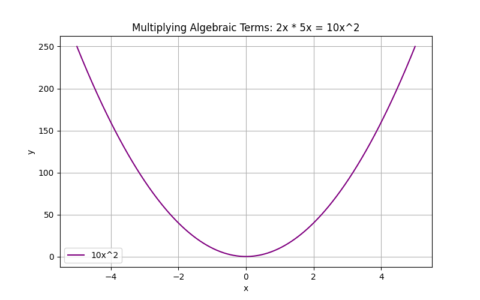

## Operations on Numbers and Algebraic Terms

This lesson explains how to perform operations on numbers and algebraic terms. We work with addition, subtraction, multiplication, and division applied to both numbers and variables. Mastering these operations is essential for solving more complex algebra problems.

> An algebraic term is a single element, which can be a constant, a variable, or a combination of both.

### Understanding Numbers and Algebraic Terms

Algebraic terms consist of numbers, variables, or both multiplied together. For example, in the term $5x$, the number $5$ is called the coefficient and $x$ is the variable. A constant is a term that does not contain a variable, such as $3$ or $-7$.

This structure allows us to represent numbers and unknowns together, enabling the modeling of real situations.

### Addition and Subtraction of Numbers

Operations on plain numbers follow the familiar rules of arithmetic. When you add numbers, you are combining quantities. For example:

$$
8 + 5 = 13
$$

Subtraction, on the other hand, finds the difference between two numbers:

$$
15 - 9 = 6
$$

These basic operations are essential in day-to-day calculations, such as summing expenses or calculating scores.

> Intuition: Think of addition as putting objects together and subtraction as taking some away. This helps when you later combine similar items in algebraic expressions.

### Operations on Algebraic Terms

When performing operations on algebraic terms, the idea of like terms is critical. Like terms have the same variable part, which means the variable and its exponent must match. Only their coefficients can differ.

For example, when adding:

$$
3x + 4x = (3+4)x = 7x
$$

Here, both terms include the variable $x$. Thus, their coefficients can be added directly, reinforcing the idea of grouping like items.

**Example 1: Combining Like Terms with a Constant**

Consider the expression:

$$
2 + 3 + 7
$$

Add the numbers step by step:

$$
2 + 3 = 5
$$

Then,

$$
5 + 7 = 12
$$

So, the sum is $12$. This process shows that even without variables, grouping similar items simplifies the expression.

**Example 2: Combining Like Terms with Variables**

Examine the expression:

$$
4y - 2y + 6
$$

First, combine the like terms with the variable $y$:

$$
4y - 2y = 2y
$$

Then, write the expression as:

$$
2y + 6
$$

Since $2y$ (a variable term) and $6$ (a constant) are unlike terms, the expression is in its simplest form.

> Intuition: Grouping like terms is like organizing similar items together, making the overall picture clearer. It helps you see which parts can be directly combined and which remain separate.

### Multiplication of Terms

When multiplying numbers or algebraic terms, multiply the coefficients and apply the laws of exponents to the variables.

For instance, multiplying simple numbers:

$$
3 \times 4 = 12
$$

For terms with variables:

$$
2x \times 5x = (2 \times 5)(x \times x) = 10x^2
$$

This works because when you multiply like bases, you add the exponents (here, $x^1 \times x^1 = x^{1+1} = x^2$).

**Example: Multiplying a Number with an Algebraic Term**

Multiply the constant $7$ by the term $3z$:

$$
7 \times 3z = 21z
$$

This rule is pivotal when expanding expressions in more complex algebraic problems.

> Intuition: Visualize multiplication as repeated addition. When variables are involved, the movement of exponents follows similar rules, helping you to keep track of how many times the variable appears.

### Division of Terms

Division simplifies expressions in a manner similar to multiplication. For numbers, you simply divide the numerator by the denominator:

$$
20 \div 4 = 5
$$

For algebraic terms with variables, divide the coefficients and subtract the exponents for like bases.

For example:

$$
\frac{8a^3}{2a} = \frac{8}{2} \times a^{3-1} = 4a^2
$$

This relies on the rule that when dividing powers with the same base, subtract the exponent in the denominator from the exponent in the numerator.

> Intuition: Think of division as distributing a quantity evenly. With variables, you distribute the number of factors by reducing the exponent, similar to reducing a fraction.

### Real-World Application

Algebraic operations are not just academic exercises; they are tools for solving real-life problems. For example, in financial planning, suppose you earn a weekly allowance represented by $w$ and receive an extra bonus of $15$ dollars. Your total earnings for the week are modeled by:

$$
w + 15
$$

If the following week your allowance increases by $3$, while the bonus remains unchanged, the new total becomes:

$$
(w + 3) + 15 = w + 18
$$

This simple change models real-life adjustments such as salary increases or updated expenses.

> Intuition: Visualize your weekly earnings as building blocks. Each component of the expression adds value, and minor adjustments can capture real changes in income.

### Key Steps and Summary

1. **Identify and classify components:** Recognize numbers, variables, and constants in an expression.

2. **Apply arithmetic rules:** Use the familiar operations of addition, subtraction, multiplication, and division for numbers.

3. **Combine like terms:** Only combine terms that have identical variable parts. Group coefficients appropriately.

4. **Multiply correctly:** Multiply coefficients and add exponents for variables.

5. **Divide carefully:** Divide coefficients and subtract exponents when variables share the same base.

Understanding these operations is fundamental to tackling more advanced algebra topics. Each step builds on your ability to simplify and solve expressions, a skill that is essential for the College Algebra CLEP exam.

