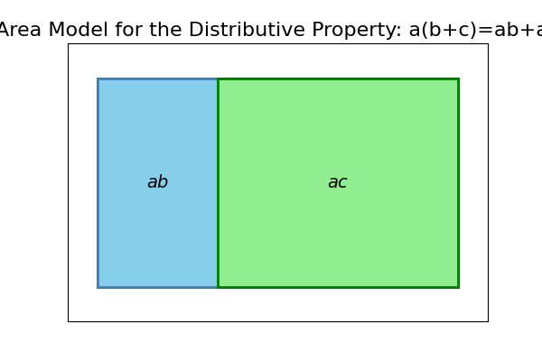

## The Distributive Property and Its Applications

The distributive property is a fundamental rule in algebra that allows you to multiply a single term by each term within parentheses. This property is written as:

$$
a(b+c)=ab+ac
$$

and similarly for subtraction:

$$
a(b-c)=ab-ac
$$

Understanding and applying the distributive property is crucial for simplifying expressions, solving equations, and making real-world calculations more manageable.

### What Is the Distributive Property?

The distributive property lets you eliminate parentheses by multiplying the term outside by each term inside them. It works with both numbers and variables. For example, in the expression

$$
3(x+4),
$$

you multiply 3 by x and 3 by 4, yielding:

$$
3 \cdot x + 3 \cdot 4 = 3x + 12.
$$

### Step-by-Step Example 1: Simple Expansion

Consider the expression

$$
-2(3y-5).
$$

Step 1: Multiply -2 by the first term (3y):

$$
-2 \cdot 3y = -6y.
$$

Step 2: Multiply -2 by the second term (-5). Remember, a negative times a negative gives a positive:

$$
-2 \cdot (-5) = 10.
$$

So, the expanded expression is:

$$
-6y+10.
$$

### Step-by-Step Example 2: Combining Multiple Terms

Expand and simplify the expression

$$
5(2x+3)-4(x-1).
$$

Begin by distributing each multiplication separately:

1. Distribute 5:

$$
5 \cdot 2x + 5 \cdot 3 = 10x+15.
$$

2. Distribute -4 (note the negative sign):

$$
-4 \cdot x + (-4) \cdot (-1) = -4x+4.
$$

Now, combine the two results:

$$
10x+15-4x+4.
$$

Combine like terms by adding the coefficients of x and the constants separately:

$$
(10x-4x)+(15+4)=6x+19.
$$

### Real-World Applications

The distributive property is not only a tool for solving algebraic expressions; it is also practical in everyday situations. Here are two examples:

1. **Financial Calculations:** 
   Suppose you are buying several items that each cost a base price plus an additional tax. If the base price is represented by $p$ and tax by $t$, then buying $n$ items can be calculated as:

   $$
n(p+t)=np+nt.
   $$
   This formula shows how the cost is distributed over each item and helps in budgeting and accounting.

2. **Engineering and Design:**
   Imagine an engineer calculating the total force applied across multiple similar components. The force on one component is given by $(F_1+F_2)$. For $k$ similar components:

   $$
k(F_1+F_2)=kF_1+kF_2.
   $$
   This use of the distributive property helps in designing systems where loads or stresses are shared evenly.

### Practice Tips

- Always multiply every term inside the parentheses by the term outside.
- Be mindful of negative signs when distributing.
- Combine like terms after distribution for a simplified expression.

The distributive property is a versatile tool. Mastery of it lays the groundwork for more advanced topics in algebra, such as factoring and equation solving. Each real-world application you encounter reinforces how this simple property can break down complex problems into manageable steps.