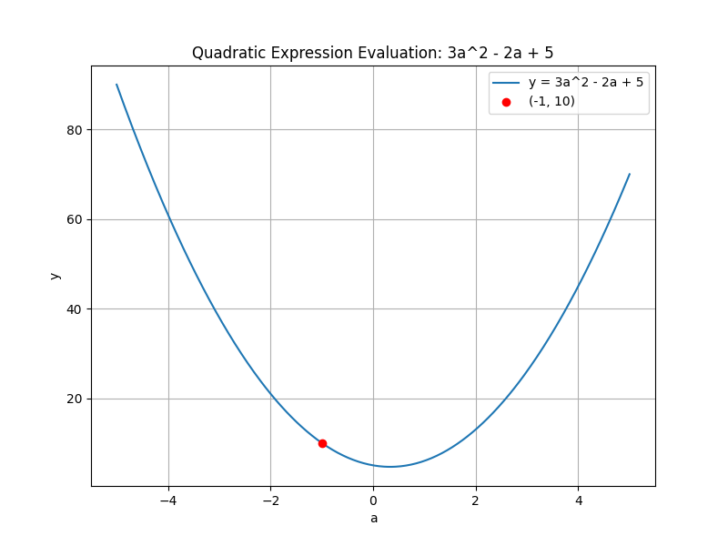

## Evaluating Algebraic Expressions

Evaluating an algebraic expression means substituting values for variables and then simplifying the result using the proper order of operations. This process is essential when solving real-world problems such as calculating costs or processing data.

> The order in which you perform operations matters: always handle parentheses, exponents, multiplication and division, then addition and subtraction.

### Understanding the Process

To evaluate an algebraic expression, follow these steps:

1. Identify the variables in the expression.
2. Substitute the given numeric values for each variable.
3. Apply the order of operations (PEMDAS): work first with parentheses, then exponents, followed by multiplication and division, and finally addition and subtraction.

This structured approach ensures you simplify the expression correctly at every step.

### Example 1: Basic Linear Expression

Consider the linear expression:

$$
2x + 3
$$

If $x = 4$, substitute the value:

$$
2(4) + 3
$$

**Explanation:**

- First, substitute $4$ in place of $x$, which gives $2(4)$.
- Next, perform the multiplication $2 \times 4$ to get $8$.
- Then, add $3$ to $8$.

So the steps are:

$$
2(4) + 3 = 8 + 3 = 11
$$

This shows that when $x = 4$, the expression $2x + 3$ evaluates to $11$.

**Intuition:**

Think of the variable $x$ as a placeholder. Once you know its value, you replace it and follow the standard order of operations to simplify the expression.

### Example 2: Expression with Parentheses and Multiplication

Consider the expression:

$$
5(2y - 3) + 7
$$

For $y = 5$, substitute $5$ for $y$:

$$
5(2(5) - 3) + 7
$$

**Step-by-step Explanation:**

- **Step 1:** Substitute $y = 5$. This gives:
  
  $$
  5(2(5) - 3) + 7
  $$

- **Step 2:** Evaluate inside the parentheses. Multiply $2 \times 5$:
  
  $$
  5(10 - 3) + 7
  $$

- **Step 3:** Subtract inside the parentheses:
  
  $$
  5(7) + 7
  $$

- **Step 4:** Multiply $5 \times 7$:
  
  $$
  35 + 7
  $$

- **Step 5:** Finally, add $35$ and $7$:
  
  $$
  42
  $$

Thus, when $y = 5$, the expression evaluates to $42$.

**Intuition:**

Evaluate expressions within parentheses first. This keeps the structure intact and avoids mistakes in handling operations.

### Example 3: Quadratic Expression

Consider the quadratic expression:

$$
3a^2 - 2a + 5
$$

For $a = -1$, substitute the value:

$$
3(-1)^2 - 2(-1) + 5
$$

**Step-by-step Explanation:**

- **Step 1:** Substitute $a = -1$:
  
  $$
  3(-1)^2 - 2(-1) + 5
  $$

- **Step 2:** Evaluate the exponent $(-1)^2$. Because $(-1)^2 = 1$, the expression becomes:
  
  $$
  3(1) - 2(-1) + 5
  $$

- **Step 3:** Multiply the coefficients:
  
  $$
  3 + 2 + 5
  $$

- **Step 4:** Add the results:
  
  $$
  10
  $$

Thus, when $a = -1$, the quadratic expression evaluates to $10$.

**Intuition:**

Remember to follow the order of operations: exponents come before multiplication, which is why $(-1)^2$ must be computed before multiplying by $3$.

### Real-World Application: Cost Calculation

Imagine you are buying tickets with the ticket cost given by the expression:

$$
C = 12n + 5
$$

Here, $n$ is the number of tickets purchased.

**Step-by-step Explanation:**

- **Step 1:** Suppose $n = 3$. Substitute the value into the expression:
  
  $$
  C = 12(3) + 5
  $$

- **Step 2:** Multiply $12 \times 3$ to get $36$.
- **Step 3:** Add the fixed cost of $5$:
  
  $$
  36 + 5 = 41
  $$

So, the total cost is $41$ dollars.

**Intuition:**

This example shows how algebraic expressions are used to model real situations, such as purchasing tickets. The term $12n$ represents a variable cost that depends on the number of tickets, while the constant $5$ represents a fixed additional fee.

### Key Steps Recap

- **Substitute:** Replace each variable with its given numeric value.
- **Observe Order:** Always follow the order of operations: parentheses, exponents, multiplication and division, addition and subtraction.
- **Simplify in Steps:** Break down the expression into smaller parts and simplify gradually.

By mastering these steps, you gain a strong foundation in algebra. This skill is vital for solving increasingly complex problems in fields like finance, engineering, and science.