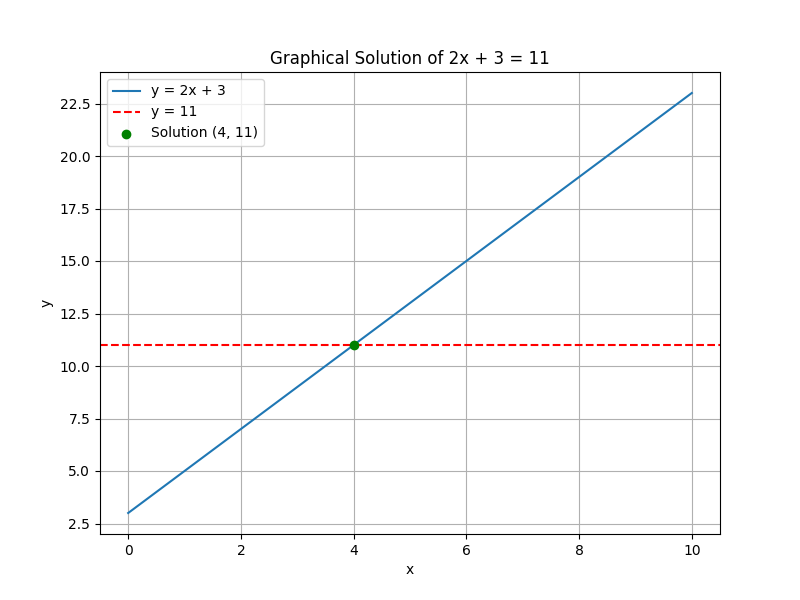

## Solving Basic Linear Equations

Linear equations are equations in which the variable appears only to the first power and there are no products of variables. The goal is to isolate the variable on one side by using inverse operations. This lesson explains the concept and outlines a step-by-step process for solving basic linear equations.

### Key Concepts

> A balanced equation remains true if the same operation is performed on both sides.

1. **Simplify Both Sides:** Remove parentheses and combine like terms to prepare the equation.
2. **Isolate the Variable:** Use addition, subtraction, multiplication, or division to move all terms containing the variable to one side and the constants to the opposite side.
3. **Verify the Solution:** Substitute the value back into the original equation to ensure that both sides are equal.

These techniques build a strong foundation for solving more complicated algebraic problems.

### Example 1: Solve $2x + 3 = 11$

This example demonstrates the process of solving a simple linear equation step by step.

**Step 1: Subtract 3 from both sides**

Removing 3 from both sides helps eliminate the constant from the left side so that the term with $x$ stands alone. This step gives:

$$
2x + 3 - 3 = 11 - 3
$$

which simplifies to:

$$
2x = 8
$$

**Step 2: Divide both sides by 2**

Dividing by the coefficient of $x$ isolates the variable. In this case, dividing by $2$ yields:

$$
\frac{2x}{2} = \frac{8}{2}
$$

Resulting in:

$$
x = 4
$$

**Step 3: Verification**

Substitute $x=4$ back into the original equation to verify the solution:

$$
2(4) + 3 = 8 + 3 = 11
$$

Since the left side equals the right side, the solution $x=4$ is correct.

### Example 2: Real-World Application

In this real-world application, a manufacturer models the total cost for producing widgets with the equation:

$$
5x - 7 = 18
$$

Here, $x$ represents the number of widgets produced after accounting for a fixed cost adjustment. The steps are similar to the previous example.

**Step 1: Add 7 to both sides**

Adding 7 cancels the constant on the left side:

$$
5x - 7 + 7 = 18 + 7
$$

This simplifies to:

$$
5x = 25
$$

**Step 2: Divide both sides by 5**

Divide by the coefficient $5$ to solve for $x$:

$$
\frac{5x}{5} = \frac{25}{5}
$$

Thus, we find:

$$
x = 5
$$

**Step 3: Interpretation**

The manufacturer produced $5$ widgets after the fixed cost adjustment. This demonstrates how linear equations can model and solve real-world production problems.

### General Steps for Solving Basic Linear Equations

1. **Eliminate Constants:** Move constant terms to the opposite side of the variable using addition or subtraction. This step reduces clutter and brings focus to the variable.

2. **Remove Multipliers:** Divide or multiply to reverse the effect of coefficients attached to the variable, thereby isolating it.

3. **Simplify and Solve:** Continue operations until the variable stands alone. Finally, verify the solution by substituting it back into the original equation.

These steps are essential as they ensure that the value obtained is the unique solution that satisfies the original equation.

Understanding and applying these systematic steps not only simplifies the solving process but also builds a strong foundation for addressing more complex algebraic problems. Practice these techniques to develop a robust problem-solving strategy.