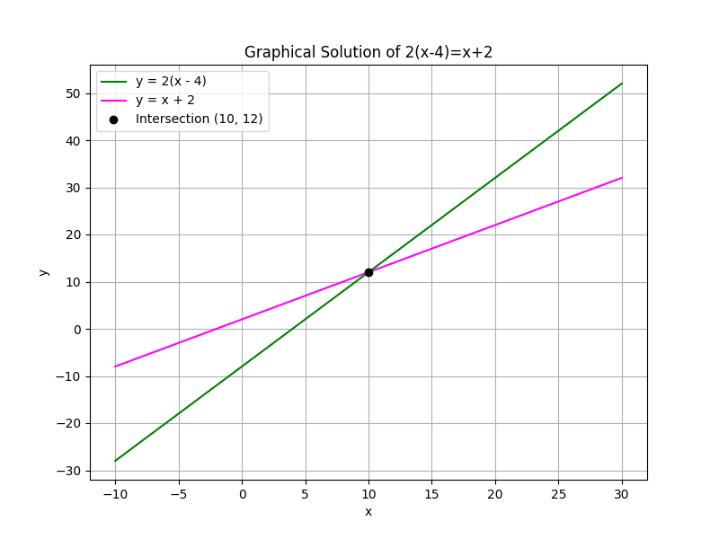

## Solving Equations with Variables on Both Sides

This lesson focuses on solving linear equations that have variables on both sides. In these equations, you must first gather the variable terms on one side and the constant terms on the other. This method simplifies the equation and allows you to isolate the variable.

> Key Insight: To solve an equation with variables on both sides, balance the equation by performing the same operation on both sides.

### Step-by-Step Process

1. **Eliminate Variables from One Side:**
   - Move all terms containing the variable to one side of the equation by adding or subtracting them. 

2. **Gather Constants on the Other Side:**
   - Move all constant terms to the opposite side using addition or subtraction.

3. **Combine Like Terms:**
   - Simplify both sides of the equation by combining similar terms.

4. **Isolate the Variable:**
   - Divide or multiply to solve for the variable.

### Example 1: Basic Equation

Solve the equation:

$$
3x + 5 = 5x - 7
$$

**Step 1: Eliminate Variable Terms from One Side**

Subtract $3x$ from both sides:

$$
3x + 5 - 3x = 5x - 7 - 3x
$$

Which simplifies to:

$$
5 = 2x - 7
$$

**Step 2: Isolate the Constant Terms**

Add $7$ to both sides to get the constant on the opposite side:

$$
5 + 7 = 2x - 7 + 7
$$

This gives:

$$
12 = 2x
$$

**Step 3: Solve for $x$**

Divide both sides by $2$:

$$
\frac{12}{2} = \frac{2x}{2}
$$

Thus:

$$
x = 6
$$

### Example 2: Equation Involving Parentheses

Consider a scenario where a small business calculates its monthly profit. The equation could be set up as:

$$
2(x - 4) = x + 2
$$

Here, $x$ represents the number of units sold beyond a baseline.

**Step 1: Expand the Equation**

Distribute the $2$ on the left side:

$$
2x - 8 = x + 2
$$

**Step 2: Eliminate the Variable from One Side**

Subtract $x$ from both sides to bring the variable terms together:

$$
2x - x - 8 = x - x + 2
$$

This simplifies to:

$$
x - 8 = 2
$$

**Step 3: Isolate the Variable**

Add $8$ to both sides:

$$
x - 8 + 8 = 2 + 8
$$

Which results in:

$$
x = 10
$$

### Real-World Application

In engineering, managing equilibrium is crucial. For example, suppose an engineer is setting up a balance between two forces. The forces on either side can be represented by an equation with variables on both sides. By rearranging the terms just as we did above, the engineer can solve for the unknown force required to maintain balance.

### Summary of Key Points

- Always perform the same operation on both sides of the equation to maintain balance.
- Collect variable terms on one side and constant terms on the other before isolating the variable.
- Check each step to ensure no errors in arithmetic or algebraic manipulation.

This structured approach provides a reliable method for solving equations with variables on both sides, an essential skill for algebra and real-world problem solving.