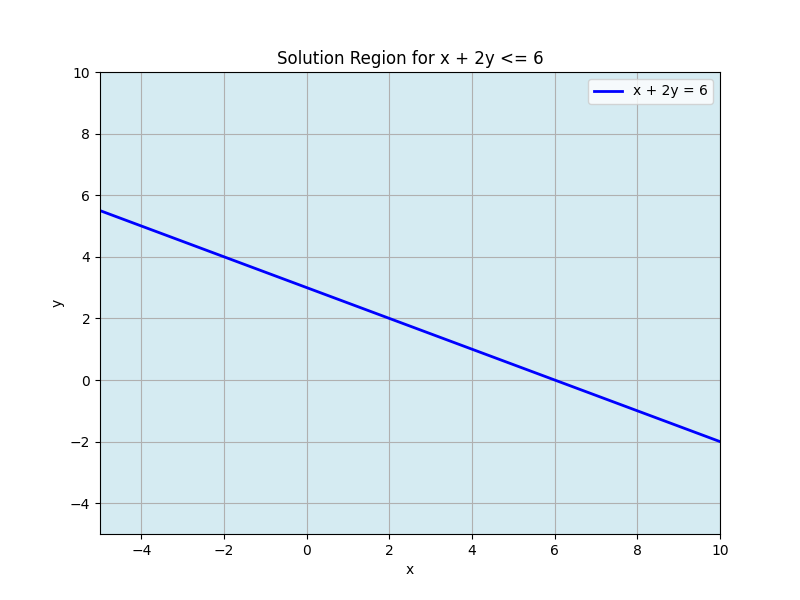
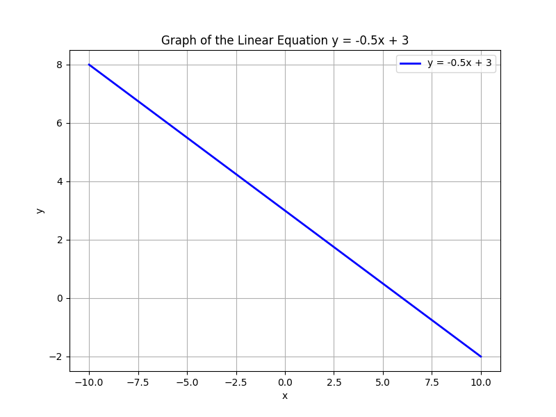

# Linear Equations and Inequalities

This unit introduces the fundamental concepts of linear equations and inequalities. In this unit, you will learn what linear equations and inequalities are, why they are crucial in algebra, and how they apply to real-life situations such as financial planning, engineering design, and data analysis.

What: This unit covers the structure of linear equations and inequalities, methods for solving them, and the graphical representation of their solutions.

Why: Mastering these topics is essential not only for advancing in algebra but also for solving practical problems. Whether you are calculating budgets, optimizing resources, or analyzing trends, linear equations and inequalities provide a solid foundation.

How: We will explore methods step by step, including isolating variables, applying arithmetic operations, and visualizing solution sets on number lines and coordinate planes. Real-world examples will illustrate how these concepts form the basis for more complex models.

> In every equation and every symbol, there lies the whisper of nature’s grand design.