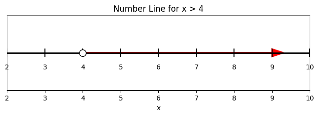
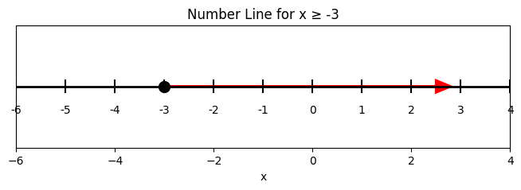

## Lesson: Solving Linear Inequalities and Graphing Solution Sets

Linear inequalities are similar to linear equations but use inequality symbols ($>$, $<$, $\ge$, $\le$) instead of an equal sign. The solution is a set of values that make the inequality true. In addition, when multiplying or dividing both sides of an inequality by a negative number, the inequality symbol must be flipped.

### Steps to Solve a Linear Inequality

1. Isolate the term with the variable on one side.
2. Perform arithmetic operations (addition, subtraction, multiplication, or division) on both sides. 
3. When multiplying or dividing by a negative number, reverse the inequality symbol.
4. Express the solution in inequality form and graph it on a number line.

### Example 1: Solve $$2x - 5 > 3$$

1. Add 5 to both sides:

$$
2x - 5 + 5 > 3 + 5
$$

$$
2x > 8
$$

2. Divide by 2:

$$
\frac{2x}{2} > \frac{8}{2}
$$

$$
x > 4
$$

The solution is all numbers greater than 4.

#### Graphing the Solution

On a number line, plot an open circle at 4 (since 4 is not included) and shade the line to the right.

\vspace*{2em}
\begin{center}
\begin{tikzpicture}[x=0.5cm]
  % Draw number line from 2 to 10
  \draw[->] (2,0) -- (10,0) node[right] {Number Line};
  % Ticks every 1 unit
  \foreach \x in {2,3,4,5,6,7,8,9,10}
      \draw (\x,0.1) -- (\x,-0.1) node[below] {\x};
  % Open circle at 4
  \draw[fill=white, thick] (4,0) circle (0.2);
  % Shade region to the right of 4
  \draw[very thick, red, ->] (4.2,0) -- (9.8,0);
\end{tikzpicture}
\end{center}
\vspace*{2em}

### Example 2: Solve $$-3x + 7 \le 16$$

1. Subtract 7 from both sides:

$$
-3x + 7 - 7 \le 16 - 7
$$

$$
-3x \le 9
$$

2. Divide by -3 and flip the inequality symbol:

$$
\frac{-3x}{-3} \ge \frac{9}{-3}
$$

$$
x \ge -3
$$

The solution is all numbers greater than or equal to -3.

#### Graphing the Solution

On a number line, plot a closed circle at -3 (since -3 is included) and shade the line to the right.

\vspace*{2em}
\begin{center}
\begin{tikzpicture}[x=0.5cm]
  % Draw number line from -6 to 4
  \draw[->] (-6,0) -- (4,0) node[right] {Number Line};
  % Ticks every 1 unit
  \foreach \x in {-6,-5,-4,-3,-2,-1,0,1,2,3,4}
      \draw (\x,0.1) -- (\x,-0.1) node[below] {\x};
  % Closed circle at -3
  \draw[fill=black] (-3,0) circle (0.2);
  % Shade region to the right of -3
  \draw[very thick, red, ->] (-2.8,0) -- (3.8,0);
\end{tikzpicture}
\end{center}
\vspace*{2em}

### Key Points to Remember

> When multiplying or dividing an inequality by a negative number, always reverse the inequality symbol.

> Graphing solution sets involves marking the boundary (using open or closed circles) and shading the region where the inequality holds.

These methods are used in many real-life situations, such as budgeting (finding acceptable ranges for expenses) or engineering (establishing safety limits). Understanding how to manipulate and graph inequalities provides a solid foundation for more complex algebraic problems.

