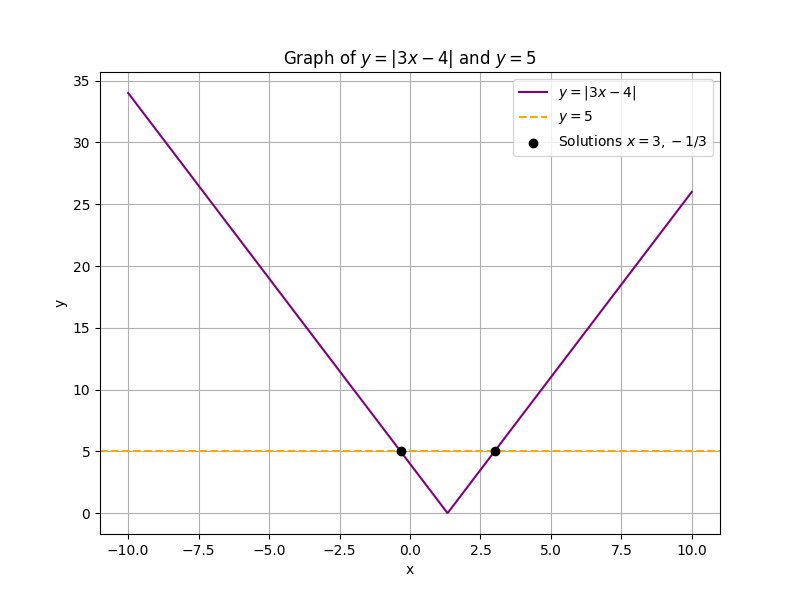

## Solving Equations with Absolute Value

Absolute value represents the distance of a number from zero. In equations, the absolute value of an expression is always nonnegative. An equation of the form

$$
|ax+b|=c
$$

leads to two separate cases when $c \geq 0$:

1. $ax + b = c$
2. $ax + b = -c$

If $c < 0$, there is no solution because an absolute value cannot equal a negative number.

### Step-by-Step Example

Consider the equation:

$$
|x - 3| = 5
$$

We set up two cases. Solve each case separately to find the solutions:

Case 1:

$$x - 3 = 5$$

$$
x = 5 + 3 = 8
$$

Case 2:

$$x - 3 = -5$$

$$
x = -5 + 3 = -2
$$

Thus, the equation $|x-3|=5$ has two solutions: $x=8$ and $x=-2$.

### Another Example with a Coefficient

Solve the equation:

$$
2|3x - 4| = 10
$$

**Step 1: Isolate the absolute value.**

Divide both sides by 2:

$$
|3x - 4| = 5
$$

**Step 2: Set up the two cases.**

Case 1:

$$
3x - 4 = 5
$$

Solve for $x$:

$$
3x = 5 + 4 = 9 \quad\Rightarrow\quad x = 3
$$

Case 2:

$$
3x - 4 = -5
$$

Solve for $x$:

$$
3x = -5 + 4 = -1 \quad\Rightarrow\quad x = -\frac{1}{3}
$$

The solutions are $x = 3$ and $x = -\frac{1}{3}$.

### Real-World Application Example

Imagine a scenario in sports analytics. A player must stay within 5 units of a target score to be considered consistent. The equation

$$
|s - T| = 5
$$

represents the deviation ($s$ is the score and $T$ is the target). Solving this equation determines the range of scores:

Case 1:

$$
 s - T = 5 \quad\Rightarrow\quad s = T + 5
$$

Case 2:

$$
 s - T = -5 \quad\Rightarrow\quad s = T - 5
$$

Thus, if the target is known, the acceptable scores are exactly 5 units above or below the target.

### Handling Special Cases

1. **No Solution:**

   If an equation takes the form

   $$
   |ax + b| = -c \quad(\text{with } c > 0),
   $$

   there is no solution since absolute value cannot be negative.

2. **Identity Equations:**

   Occasionally, after isolating the absolute value, you may get a true statement for all values. For example, if the equation simplifies to

   $$
   |x - 3| = |x - 3|,
   $$

   the equation is true for all values of $x$ in its domain.

### Summary of the Process

- Isolate the absolute value expression.
- Set up two cases: one with a positive and one with a negative expression of the right side.
- Solve both linear equations.
- Check answers if needed, especially in applied problems where the context may restrict valid solutions.

Understanding these steps provides a reliable method to solve equations involving absolute values in various college algebra problems.