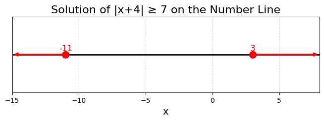

## Solving Inequalities with Absolute Values

Absolute value inequalities require special handling because the absolute value function measures the distance from zero. In other words, for any expression $f(x)$, the absolute value $|f(x)|$ tells us how far $f(x)$ is from $0$ regardless of its sign.

There are two main forms of absolute value inequalities:

1. Inequalities of the form $$|ax+b| < c$$ where $c > 0$.
2. Inequalities of the form $$|ax+b| > c$$ where $c > 0$.

> Absolute value inequalities can often be rewritten as compound inequalities or as two separate inequalities.

### 1. Solving Inequalities of the Form $|ax+b| < c$

When you have an inequality such as $|ax+b| < c$, you can rewrite it as a compound inequality:

$$
-c < ax+b < c
$$

**Example 1: Solve $|2x-3| < 5$**

Step 1: Rewrite the inequality:

$$
-5 < 2x-3 < 5
$$

Step 2: Isolate the term with $x$ by adding $3$ to each part:

$$
-5 + 3 < 2x-3+3 < 5+3
$$

$$
-2 < 2x < 8
$$

Step 3: Divide each part by $2$:

$$
-1 < x < 4
$$

The solution is all $x$ such that $x$ is between $-1$ and $4$.

**Graphical Representation:**

On a number line, you would show an open circle at $-1$ and an open circle at $4$ with all points in between shaded.

### 2. Solving Inequalities of the Form $$|ax+b| > c$$

For an inequality like $|ax + b| > c$, the expression inside the absolute value must be greater than $c$ units away from zero. This creates two separate conditions:

$$
ax+b < -c \quad \text{or} \quad ax+b > c
$$

**Example 2: Solve $|x+4| \ge 7$**

Step 1: Break the inequality into two cases. Note that when we have a "greater than or equal to" inequality, equality is included:

1. $$x+4 \le -7$$

2. $$x+4 \ge 7$$

Step 2: Solve each inequality separately.

For case 1:

$$
\begin{aligned}
 x+4 &\le -7 \\
 x &\le -7-4 \\
 x &\le -11
\end{aligned}
$$

For case 2:

$$
\begin{aligned}
 x+4 &\ge 7 \\
 x &\ge 7-4 \\
 x &\ge 3
\end{aligned}
$$

The solution is all $x$ such that $$x \le -11 \quad \text{or} \quad x \ge 3.$$

**Graphical Representation:**

A number line would show a closed circle at $-11$ with all points to the left shaded, and another closed circle at $3$ with all points to the right shaded.

### 3. Real-World Application

Absolute value inequalities are often used to express error tolerances. For instance, suppose a machine part must be within $0.5$ mm of its target measurement of $10.0$ mm. The acceptable measurements $m$ satisfy:

$$
|m-10.0| \le 0.5
$$

Rewriting this inequality as a compound inequality gives:

$$
-0.5 \le m-10.0 \le 0.5
$$

Adding $10.0$ to each part:

$$
9.5 \le m \le 10.5
$$

This indicates that any measurement between $9.5$ mm and $10.5$ mm is acceptable.

### 4. Special Considerations

- If $c$ is negative in an inequality such as $$|ax+b| < c$$ or $$|ax+b| \le c$$, there is no solution because absolute value is always non-negative.

- When dealing with $$|ax+b| \ge c$$ and $c$ is negative, the inequality is always true, since the absolute value is always greater than or equal to any negative number.

### 5. Summary of Steps

- **Isolate the Absolute Value:** Make sure the absolute value expression is alone on one side of the inequality.
- **Determine the Form:** Identify whether the inequality is of the form

$$|ax+b| < c$$

or

$$|ax+b| > c$$

- **Rewrite Appropriately:** For $<$, rewrite as a compound inequality. For $>$, split into two separate inequalities.
- **Solve the Resulting Inequalities:** Solve for the variable in each resulting inequality.

By following these steps, you can solve a wide range of inequalities involving absolute values. This technique is applicable in various contexts, including error tolerance in engineering and quality control in manufacturing.