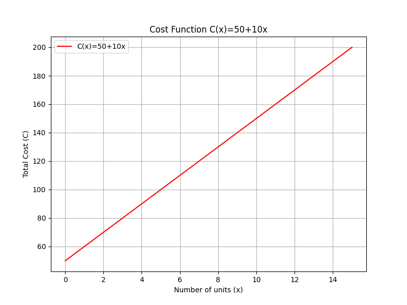

## Defining Functions and Function Notation

A function is a rule that assigns each input exactly one output. In algebra, functions provide a systematic way to relate two quantities where one depends on the other.

> “Pure mathematics is, in its way, the poetry of logical ideas.” – Albert Einstein

### What Is a Function?

A function associates every element in a set (called the domain) with one unique element in another set (called the range). When you input a value into a function, you get exactly one corresponding output.

### Function Notation

Function notation uses a letter, typically $f$, followed by parentheses. The expression inside the parentheses represents the input value. For example, if we write

$$
f(x) = 2x + 3,
$$

then $f(x)$ indicates the output when $x$ is used as input. Here:

- $f$ is the name of the function.
- $x$ is the variable representing the input.

### Evaluating a Function

To evaluate a function, substitute a specific number for the variable and simplify.

**Example**

$$
f(x) = 2x + 3
$$

Evaluate $f(4)$ as follows:

1. Replace $x$ with 4:

$$
f(4) = 2(4) + 3
$$

2. Multiply $2$ by $4$ to get 8:

$$
f(4) = 8 + 3
$$

3. Add 8 and 3:

$$
f(4) = 11
$$

Thus, $f(4) = 11$.

### Real-World Application

Functions are useful in many real-world scenarios. Consider a simple cost function for producing items.

**Example**

$$
C(x) = 50 + 10x
$$

where:

- $C(x)$ represents the total cost,
- $50$ is the fixed cost (the cost that does not change with production), and
- $10x$ is the variable cost (the cost that changes with the number of units produced, $x$).

If a company produces 7 units, the total cost is computed as:

$$
C(7) = 50 + 10(7) = 50 + 70 = 120
$$

This model helps businesses predict costs based on production levels.

### Key Vocabulary

- **Domain:** The set of all possible input values for the function.
- **Range:** The set of all possible output values for the function.
- **Function Notation:** A symbolic representation that shows the relationship between inputs and outputs, such as $f(x)$.

Understanding functions and their notation is fundamental to solving equations, modeling real-life situations, and preparing for advanced topics in algebra.

### Input-Output Table Example

To clearly see how inputs map to outputs, consider the following table that lists several values of $x$ and their corresponding $f(x)$ values for the function $f(x) = 2x + 3$:

| $x$ | $f(x)$ |
|-----|-------------|
| 0   | 3           |
| 1   | 5           |
| 2   | 7           |
| 3   | 9           |
| 4   | 11          |

This table shows how each input value of $x$ produces exactly one output value $f(x)$, illustrating the function's definition.