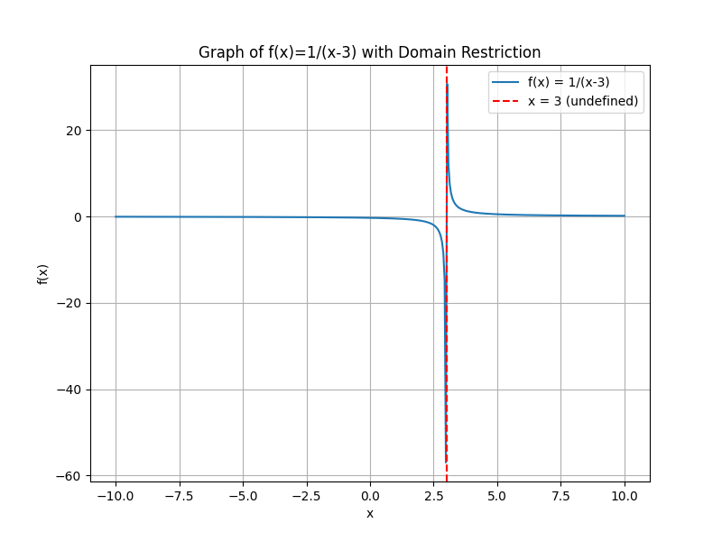
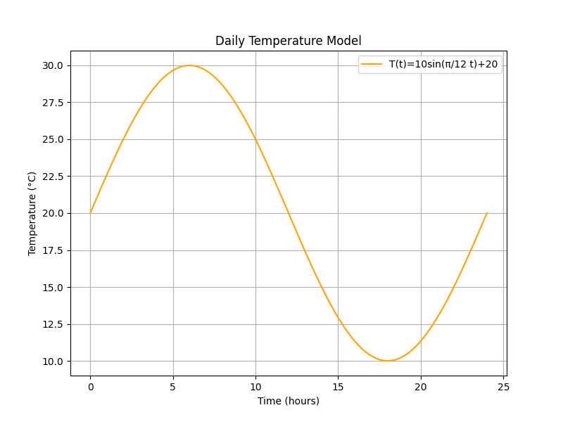

## Lesson: Domain and Range of Functions

The domain and range of a function are two key concepts that describe the set of input values and the set of output values, respectively. Understanding these sets is essential for analyzing functions, ensuring you know which values can be input and what outputs to expect. This understanding is critical in avoiding mistakes such as division by zero or undefined operations.

### Definitions

- The **domain** of a function is the set of all possible values of $x$ for which the function is defined. It represents the allowed inputs. Intuitively, think of the domain as the "playground" where the function operates correctly.

- The **range** of a function is the set of all possible outputs or $y$-values the function produces as $x$ varies over the domain. The range tells you the spectrum of results you can expect from the given inputs.

> Knowing the domain and range helps determine what values a function can accept and produce, which is essential for both theoretical analysis and practical applications.

### Determining the Domain

To find the domain of a function, follow these steps:

1. **Identify Restrictions:** Look for operations that might limit the values of $x$, such as division by zero, taking the square root of negative numbers, or restrictions from logarithms.

2. **Set Conditions:** Write down the conditions that must be met for every operation in the function to be valid.

3. **Express the Domain:** Use interval notation or set-builder notation to clearly describe the allowed values of $x$.

#### Example 1: Rational Function

Consider the function:

$$
f(x)=\frac{1}{x-3}.
$$

The function is undefined when the denominator is zero. Set up the condition by ensuring the denominator is not zero:

$$
x-3 \neq 0 \quad\Longrightarrow\quad x \neq 3.
$$

Thus, the domain is all real numbers except $3$, which is written as:

$$
(-\infty,3) \cup (3,\infty).
$$

This method prevents errors by explicitly excluding values that cause undefined operations.

#### Example 2: Square Root Function

Consider the function:

$$
g(x)=\sqrt{x-2}.
$$

For a square root function, the expression under the square root must be non-negative. Set the condition:

$$
x-2 \ge 0 \quad\Longrightarrow\quad x \ge 2.
$$

So, the domain is:

$$
[2,\infty).
$$

This guarantees that every input value will produce a real number result.

### Determining the Range

Finding the range involves understanding how the function transforms the set of input values into outputs. Here are the steps:

1. **Analyze the Function's Behavior:** Consider how the output $y$ changes as $x$ varies over its domain. Observe the effects of operations like squaring or taking square roots.

2. **Invert the Relationship if Possible:** For invertible functions, solve the equation $y=f(x)$ for $x$. The valid $y$ values that yield allowable $x$ form the range.

3. **Express the Range:** Use interval notation or set-builder notation to state the set of all possible $y$ values.

#### Example 3: Quadratic Function

Consider the function:

$$
h(x)=x^2.
$$

There are no restrictions on $x$, so the domain is:

$$
(-\infty,\infty).
$$

However, since squaring any real number produces a non-negative result, the range is:

$$
[0,\infty).
$$

This shows that although the function accepts any real number, its outputs are confined to non-negative values.

#### Example 4: Transformed Square Root Function

Consider the function:

$$
k(x)=2\sqrt{x-2}+3.
$$

First, determine the domain. The square root requires:

$$
x-2 \ge 0 \quad\Longrightarrow\quad x \ge 2,
$$

so the domain is:

$$
[2,\infty).
$$

Next, determine the range. The basic square root function $\sqrt{x-2}$ produces values in $[0,\infty)$. Multiplying by $2$ stretches these values and adding $3$ shifts them upward. The minimum value occurs when $x=2$:

$$
k(2)=2\sqrt{2-2}+3=3.
$$

Thus, the range is:

$$
[3,\infty).
$$

This demonstrates how modifications to a basic function affect its overall output.

### Graphical Interpretation

Graphing a function can provide clear visual insight into its domain and range.

- **Domain:** Plot a horizontal number line and mark the $x$ values for which the function is defined. For instance, for $f(x)=\frac{1}{x-3}$, an open circle is drawn at $x=3$ to indicate that this value is excluded.

- **Range:** Observe the set of $y$-values on the graph. For $h(x)=x^2$, notice that the graph only includes $y$ values from $0$ upwards.

Visual representation not only reinforces the computed domain and range but also builds intuition about how functions behave.

> Visualizing the function on a graph is a powerful strategy for understanding its behavior and avoiding common errors in analyzing domains and ranges.

### Real-World Application: Modeling Temperature

Imagine a function that models the temperature $T$ (in degrees Celsius) over a day:

$$
T(t)=10\sin\left(\frac{\pi}{12}t\right)+20,
$$

where $t$ represents time in hours.

- **Domain:** Since the model covers a 24-hour period, $t$ ranges from $0$ to $24$, so the domain is:

$$
[0,24].
$$

- **Range:** The sine function produces values between $-1$ and $1$. After scaling by $10$ and shifting upward by $20$, the minimum and maximum temperatures are calculated as follows:

$$
\text{Minimum: }10(-1)+20=10, \quad \text{Maximum: }10(1)+20=30.
$$

Thus, the range is:

$$
[10,30].
$$

This example shows how domain and range are applied in real-world contexts to create realistic models with proper input and output constraints.

### Summary of Key Points

- The **domain** is the set of all valid input values for a function, while the **range** is the set of all possible output values.

- To determine the domain, identify any restrictions (such as division by zero or a negative number under a square root) and express the conditions using proper notation.

- The range is found by analyzing how the function processes the allowed inputs. In some cases, it may be necessary to invert the function to determine the set of outputs.

A robust understanding of domain and range is essential for both solving algebraic problems and applying these concepts in scientific and real-world situations.