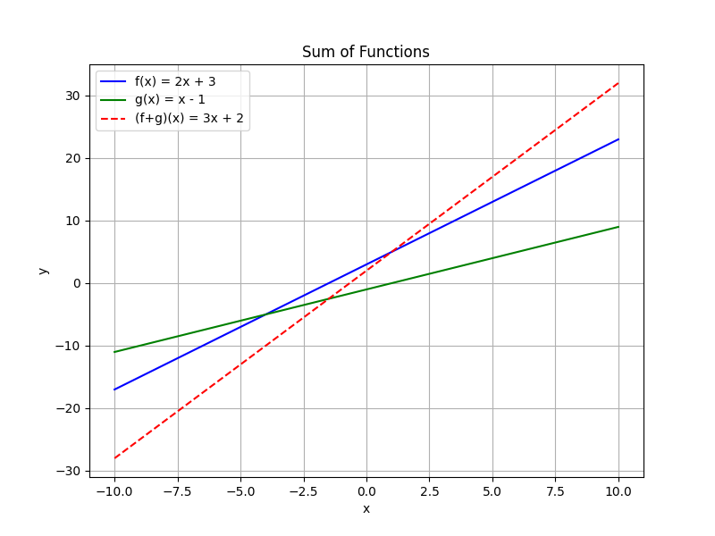
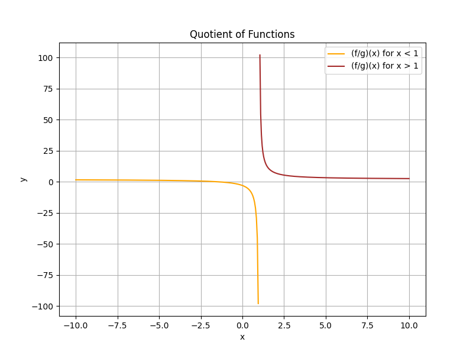

## Algebra of Functions: Sums, Products, and Quotients

In this lesson, we explore how to combine functions using basic algebraic operations. We will define the sum, product, and quotient of functions and provide detailed, step-by-step examples. These operations allow us to build new function models by combining simpler ones and are essential for modeling complex real-world situations such as cost analysis, physics calculations, and data analytics.

### Sums of Functions

When adding two functions, we combine them pointwise. This means for each $x$, we add the outputs of the two functions. Formally, the sum function is defined as:

$$
(f+g)(x)=f(x)+g(x).
$$

The domain of the sum is the set of all $x$ values that are common to both $f(x)$ and $g(x)$. This operation can be thought of as merging the effects or contributions of two distinct processes into one comprehensive result. For example, if one function represents cost from material and another from labor, their sum represents the total cost.

**Example:**

Let

$$
f(x)=2x+3 \quad\text{and}\quad g(x)=x-1.
$$

Then the sum function is:

$$
(f+g)(x)=(2x+3)+(x-1)=3x+2.
$$

This example shows that by adding the two functions, you combine their rules into one new rule.

### Products of Functions

The product of two functions multiplies their outputs at each point $x$. It is defined as:

$$
(f\cdot g)(x)=f(x)\cdot g(x).
$$

As with sums, the domain of the product is the intersection of the domains of $f(x)$ and $g(x)$. Multiplying functions can be particularly useful when variables interact in a multiplicative manner—for example, in computing areas (length times width) or in models where one effect scales another.

**Example:**

Given:

$$
f(x)=2x+3 \quad\text{and}\quad g(x)=x-1,
$$

compute the product function:

$$
(f\cdot g)(x)=(2x+3)(x-1).
$$

Expanding using the distributive property:

$$
\begin{aligned}
(2x+3)(x-1) &= 2x\cdot x + 2x\cdot(-1) + 3\cdot x + 3\cdot(-1) \\
            &= 2x^2 - 2x + 3x - 3 \\
            &= 2x^2 + x - 3.
\end{aligned}
$$

This detailed expansion shows how each term interacts, resulting in a quadratic function.

### Quotients of Functions

For the quotient of two functions, you divide the output of one function by the output of the other. The quotient is defined by:

$$
\left(\frac{f}{g}\right)(x)=\frac{f(x)}{g(x)}, \quad \text{provided that } g(x)\neq 0.
$$

The domain of the quotient includes all $x$ values common to both functions, except where $g(x)=0$ because division by zero is undefined. This operation is useful when determining ratios, such as calculating speed (distance divided by time) or efficiency.

**Example:**

Using the functions:

$$
f(x)=2x+3 \quad\text{and}\quad g(x)=x-1,
$$

the quotient function is:

$$
\left(\frac{f}{g}\right)(x)=\frac{2x+3}{x-1}, \quad \text{with } x\neq 1.
$$

It is important to always verify the domain for quotients and recognize where the function is not defined.

### Domain Considerations

For all operations on functions, the domain is a key aspect to consider:

- **Sum and Product:** The domain is the set of all $x$ values common to both functions.
- **Quotient:** Besides using the common domain of both functions, any $x$ that results in $g(x)=0$ must be excluded.

This careful attention to domains ensures that the operations are performed within valid ranges, maintaining the integrity of any mathematical model.

### Real-World Application

Consider a sports analytics model where $f(x)$ represents the number of successful field goals in $x$ games, and $g(x)$ represents the number of attempts. 

- The **sum** function could model the combined total successes from two players or two game segments.
- The **product** function might simulate scenarios where success rate depends on both the number of attempts and another scaling factor.
- The **quotient** function can provide an average success rate per game by dividing total successes by total attempts, with special attention to games with no attempts.

These operations allow analysts to merge and compare different data sets, enhancing decision-making processes.

> A function is like a machine: it takes an input, processes it, and produces an output. Approach each operation carefully to understand how these transformations work and how they can be applied in real-world scenarios.