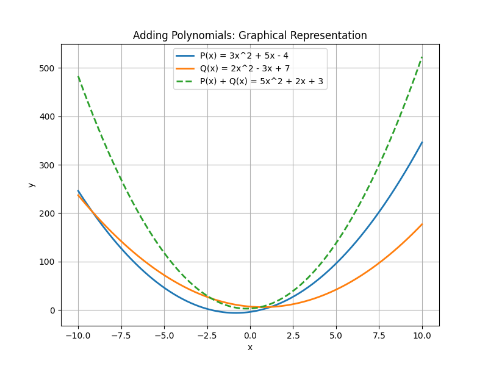

## Adding and Subtracting Polynomials

In this lesson, we learn how to add and subtract polynomials by combining like terms. Like terms are terms that share the same variable part raised to the same power. This process is similar to adding similar expenses or combining scores, where grouping similar items simplifies the overall expression.

### Identifying Like Terms

Polynomials consist of several terms. Only terms with the same variable and exponent can be combined. For example, consider the polynomial:

$$
3x^2 + 5x - 4
$$

In this expression:

- The term $3x^2$ can only be combined with other $x^2$ terms.
- The term $5x$ can only be combined with other $x$ terms.
- The constant $-4$ can only be combined with other constants.

This method of grouping similar components is key in ensuring that each part of the expression is processed correctly.

### Steps for Adding and Subtracting Polynomials

1. Rewrite each polynomial so that like terms line up in descending order (highest power to lowest power).
2. If a term is missing in one polynomial, treat it as having a coefficient of zero to maintain proper alignment.
3. Combine the like terms by adding or subtracting their coefficients.
4. Write the result starting with the highest degree term.

Following these steps ensures every term is accurately addressed, reducing errors especially when dealing with polynomials of higher degrees.

### Example 1: Adding Polynomials

**Problem:** Add the polynomials

$$
P(x) = 3x^2 + 5x - 4
$$

and

$$
Q(x) = 2x^2 - 3x + 7
$$

**Explanation and Solution:**

1. Align the polynomials so that like terms are vertically matched:

$$
\begin{array}{rcrcr}
  3x^2 &+& 5x &-& 4 \\
+\;2x^2 &-& 3x &+& 7 \\
\end{array}
$$

2. Combine the like terms by adding their coefficients:

   - $x^2$ terms: $3x^2 + 2x^2 = 5x^2$
   
   - $x$ terms: $5x + (-3x) = 2x$
   
   - Constants: $-4 + 7 = 3$

3. Write the final polynomial:

$$
5x^2 + 2x + 3
$$

This systematic approach shows how each group of like terms contributes to the final result.

### Example 2: Subtracting Polynomials

**Problem:** Subtract the polynomial

$$
R(x) = 2x^3 + 3x^2 - 4x + 2
$$

from

$$
S(x) = 4x^3 - x^2 + 6x - 5
$$

In other words, compute $S(x) - R(x)$.

**Explanation and Solution:**

1. Write the subtraction by distributing the negative sign to the entire $R(x)$:

$$
4x^3 - x^2 + 6x - 5 \; - \; \Bigl(2x^3 + 3x^2 - 4x + 2\Bigr)
$$

2. Remove the parentheses, ensuring the negative sign changes every term inside:

$$
4x^3 - x^2 + 6x - 5 - 2x^3 - 3x^2 + 4x - 2
$$

3. Combine like terms:

   - $x^3$ terms: $4x^3 - 2x^3 = 2x^3$
   
   - $x^2$ terms: $-x^2 - 3x^2 = -4x^2$
   
   - $x$ terms: $6x + 4x = 10x$
   
   - Constants: $-5 - 2 = -7$

4. The simplified result is:

$$
2x^3 - 4x^2 + 10x - 7
$$

This example emphasizes the importance of carefully distributing negative signs to avoid common mistakes.

### Real-World Application

Consider a scenario in which a business monitors monthly revenue changes across different departments. Suppose one department's revenue change is represented by

$$
R_1(x) = 3x^2 + 5x - 4,
$$

and another by

$$
R_2(x) = 2x^2 - 3x + 7.
$$

By adding these functions, the total revenue change becomes:

$$
R(x) = R_1(x) + R_2(x) = 5x^2 + 2x + 3.
$$

This combined polynomial provides a clearer picture of overall business performance, illustrating how the sum of individual contributions leads to a comprehensive result.

### Practice with Negative Coefficients

When subtracting polynomials, it is crucial to distribute the negative sign to every term in the polynomial being subtracted. This careful distribution ensures that like terms are correctly combined without sign errors. Always double-check your sign changes during the process.

By understanding and following these detailed steps, you can confidently add and subtract any polynomials. Mastering these techniques builds a foundation for tackling more complex algebra problems on the College Algebra CLEP exam.