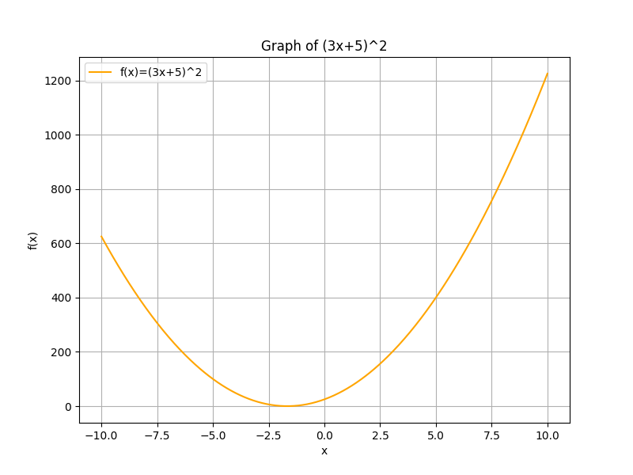

## Multiplying Polynomials and Special Products

In this lesson, we will learn how to multiply polynomials and recognize special products. Multiplying polynomials involves using the distributive property to multiply each term in one polynomial by every term in the other polynomial. Special products are specific patterns that occur when multiplying binomials, which allow us to expand expressions more quickly and accurately.

### Multiplying Polynomials

To multiply two polynomials, apply the distributive property. Multiply each term in the first polynomial by each term in the second polynomial, then combine like terms.

For example, consider the multiplication of two binomials:

$$
(2x + 3)(x + 4)
$$

Step 1: Multiply the first term in the first binomial by each term in the second binomial:

$$
2x \cdot x = 2x^2
$$

$$
2x \cdot 4 = 8x
$$

Step 2: Multiply the second term in the first binomial by each term in the second binomial:

$$
3 \cdot x = 3x
$$

$$
3 \cdot 4 = 12
$$

Step 3: Combine like terms:

$$
2x^2 + 8x + 3x + 12 \quad \Longrightarrow \quad 2x^2 + 11x + 12
$$

This method works for polynomials of any size. For example, if you multiply a trinomial by a binomial, such as:

$$
(x^2 + 2x + 3)(x + 4)
$$

Multiply each term of the trinomial by each term of the binomial:

1. Multiply $x^2$ by each term:

$$
x^2 \cdot x = x^3 \quad \text{and} \quad x^2 \cdot 4 = 4x^2
$$

2. Multiply $2x$ by each term:

$$
2x \cdot x = 2x^2 \quad \text{and} \quad 2x \cdot 4 = 8x
$$

3. Multiply $3$ by each term:

$$
3 \cdot x = 3x \quad \text{and} \quad 3 \cdot 4 = 12
$$

Then add all the terms:

$$
x^3 + (4x^2 + 2x^2) + (8x + 3x) + 12 \quad \Longrightarrow \quad x^3 + 6x^2 + 11x + 12
$$

### Special Products

Recognizing special products can simplify calculations. Some of the most common special products are:

> **Square of a Binomial:**
>
> $$
> (a+b)^2 = a^2 + 2ab + b^2
> $$
>
> $$
> (a-b)^2 = a^2 - 2ab + b^2
> $$

> **Product of Sum and Difference (Difference of Squares):**
>
> $$
> (a+b)(a-b) = a^2 - b^2
> $$

#### Example 1: Square of a Binomial

Expand $$(3x + 5)^2$$ using the square of a binomial formula.

According to the formula:

$$
(3x + 5)^2 = (3x)^2 + 2(3x)(5) + (5)^2
$$

Calculate each term:

$$
(3x)^2 = 9x^2
$$

$$
2(3x)(5) = 30x
$$

$$
(5)^2 = 25
$$

Thus, the expanded form is:

$$
9x^2 + 30x + 25
$$

#### Example 2: Difference of Squares

Expand $$(x + 7)(x - 7)$$ using the product of a sum and a difference.

Using the formula:

$$
(x + 7)(x - 7) = x^2 - 7^2
$$

Calculate the square:

$$
x^2 - 49
$$

This process is especially useful in situations where quick calculations are needed, such as in engineering problems or financial modeling where estimation speed is important.

### Application in Real World Context

Consider a scenario in sports analytics. Suppose the score difference between two teams can be modeled by a binomial expression. Multiplying such expressions can help project combined scores over a series of games. For example, if one game’s score difference is represented by $$(2x + 3)$$ and another by $$(x + 4)$$, then the product gives a simplified representation of combined performance:

$$
(2x + 3)(x + 4) = 2x^2 + 11x + 12
$$

Here, each term might correspond to different statistical measures that contribute to the overall team performance.

### Summary of Steps

1. Multiply each term in the first polynomial by every term in the second.
2. Use the distributive property systematically.
3. Combine like terms to simplify the expression.
4. Recognize and apply special product formulas to speed up calculations.

Mastering these techniques is essential for handling more complex algebraic expressions and for solving higher-level problems on the CLEP exam.