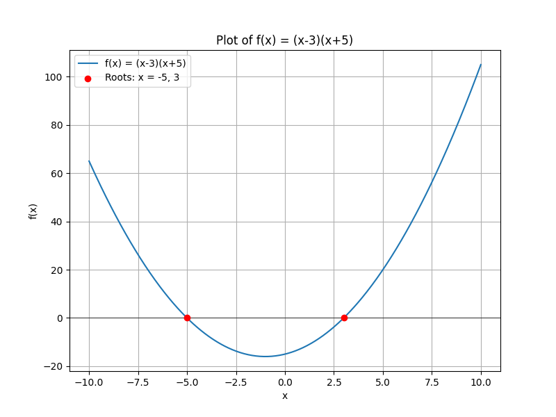

## Solving Polynomial Equations Using the Zero Product Property

The zero product property is a fundamental tool in algebra for solving polynomial equations that have been expressed as a product of simpler factors. When a product equals zero, at least one of its factors must equal zero. This lesson explains the property, provides intuitive understanding, and demonstrates how to use it step by step.

### Key Concept: The Zero Product Property

The zero product property can be stated as follows: if

$$
  a \cdot b = 0,
$$

then either

$$
  a = 0 \quad \text{or} \quad b = 0.
$$

This means that if you can write a polynomial equation as a product of factors equaling zero, you can set each factor to zero and solve the resulting simpler equations. This approach simplifies complex equations by reducing them into a series of basic problems.

### Step-by-Step Procedure

1. **Write the Equation in Factored Form**

   Ensure that the polynomial is completely factored. The typical form is:

   $$
     (\text{factor}_1)(\text{factor}_2) \cdots (\text{factor}_n) = 0.
   $$

   Factoring breaks the polynomial into simpler pieces that are easier to solve. This step often requires identifying common factors or applying techniques such as grouping or using formulas for special products.

2. **Apply the Zero Product Property**

   Set each factor equal to zero. This creates a system of simple equations:

   $$
     \text{factor}_1 = 0, \quad \text{factor}_2 = 0, \quad \ldots, \quad \text{factor}_n = 0.
   $$

   Intuitively, if multiplying several numbers gives zero, then at least one of those numbers must be zero, which allows you to work with each component separately.

3. **Solve Each Equation**

   Solve the individual equations for the variable. The complete set of solutions to the original equation is the collection of solutions from each factor.

4. **Check the Solutions (if necessary)**

   In some cases, substitute the solutions back into the original equation to verify that they work. This step ensures that no extraneous solutions are accepted, particularly if the equation was modified during solving.

### Example 1: A Direct Application

Solve the equation:

$$
  (x - 3)(x + 5) = 0.
$$

**Step 1: Apply the Zero Product Property**

Set each factor equal to zero:

$$
  x - 3 = 0 \quad \text{or} \quad x + 5 = 0.
$$

**Step 2: Solve Each Equation**

For the first factor:

$$
  x - 3 = 0 \quad \Longrightarrow \quad x = 3.
$$

For the second factor:

$$
  x + 5 = 0 \quad \Longrightarrow \quad x = -5.
$$

The solutions to the equation are $x = 3$ and $x = -5$. This example shows how quickly the property lets you break down and solve the equation.

### Example 2: Factoring Before Applying the Property

Solve the quadratic equation:

$$
  x^2 + x - 12 = 0.
$$

**Step 1: Factor the Quadratic**

Identify two numbers that multiply to $-12$ (the constant term) and add to $1$ (the coefficient of $x$). The numbers $4$ and $-3$ work because $4 \cdot (-3) = -12$ and $4 + (-3) = 1$. Thus, factor the quadratic as:

$$
  x^2 + x - 12 = (x + 4)(x - 3) = 0.
$$

**Step 2: Apply the Zero Product Property**

Set each factor equal to zero:

$$
  x + 4 = 0 \quad \text{or} \quad x - 3 = 0.
$$

**Step 3: Solve Each Equation**

For the first factor:

$$
  x + 4 = 0 \quad \Longrightarrow \quad x = -4.
$$

For the second factor:

$$
  x - 3 = 0 \quad \Longrightarrow \quad x = 3.
$$

The solutions to the equation are $x = -4$ and $x = 3$. Factoring allowed us to use the property effectively.

### Real-World Application Example

Consider an engineering problem where a component's performance depends on its width, $w$, measured in centimeters. The performance function is modeled by:

$$
  (w - 2)(w + 7) = 0.
$$

Applying the zero product property, set each factor equal to zero:

$$
  w - 2 = 0 \quad \text{or} \quad w + 7 = 0.
$$

Solve for $w$:

- From $w - 2 = 0$, we get $w = 2$ cm.
- From $w + 7 = 0$, we get $w = -7$ cm.

Since a negative width is not physically meaningful in this context, the acceptable solution is $w = 2$ cm.

This example illustrates how the zero product property not only simplifies mathematical solving but also helps in discarding unrealistic solutions in real-world applications.

By mastering the zero product property, you gain a powerful method for breaking down and solving complex polynomial equations. Understanding and applying this property is essential for success in College Algebra and for tackling real-life problems in various fields such as engineering, finance, and science.