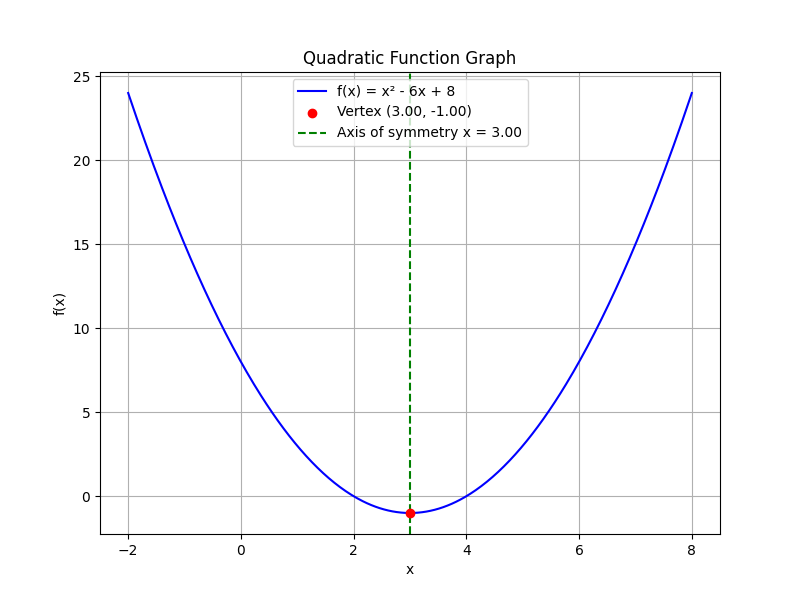

# Quadratic Functions and Equations

This unit covers quadratic functions and equations, focusing on key ideas such as the standard form, vertex, axis of symmetry, and the methods used to solve quadratic equations. You will be introduced to various techniques including factoring, using the quadratic formula, and completing the square. Through a clear and structured approach, this unit will show you how quadratic relationships appear in practical scenarios like projectile motion, profit optimization, and design geometry.

Quadratic functions are essential in understanding patterns and making predictions in numerous fields such as physics, engineering, and economics. By learning to analyze and solve these equations, you build a strong foundation for more advanced algebraic concepts.

In this unit, you will learn to:

- Recognize the standard quadratic form: $$ ax^2 + bx + c = 0 $$
- Identify and interpret the vertex, axis of symmetry, and intercepts of a quadratic function's graph.
- Apply multiple methods to solve quadratic equations, ensuring a flexible approach to problem solving.

> A quadratic equation is like a graceful arch bridging two realms—each solution a turning point in the tale of symmetry.

Approach this unit step by step. The concepts introduced here will not only help you excel on the CLEP exam but also equip you with the problem-solving skills needed for real-world applications.