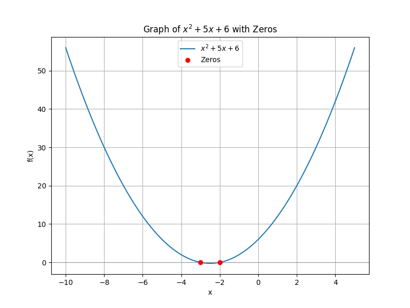

## Solving Quadratic Equations by Factoring

Quadratic equations are equations of the form $$ax^2 + bx + c = 0$$. When the quadratic can be factored, we can solve the equation by setting each factor equal to zero. This method uses the zero product property, which states that if $$A \times B = 0$$ then either $$A = 0$$, $$B = 0$$, or both.

### Key Concepts

- **Quadratic Equation:** An equation in the form $$ax^2 + bx + c = 0$$ where $$a \neq 0$$.
- **Factoring:** Writing the quadratic as a product of two binomials. For example, factoring $$x^2 + 5x + 6$$ gives $$(x + 2)(x + 3)$$.
- **Zero Product Property:** If $$PQ = 0$$ then $$P = 0$$ or $$Q = 0$$.

### Step-by-Step Process

1. **Write the Equation in Standard Form:** Ensure the equation is in the form $$ax^2 + bx + c = 0$$.

2. **Factor the Quadratic:** Find two numbers that multiply to $$a \times c$$ and add to $$b$$. Express the quadratic as a product of two binomials.

3. **Apply the Zero Product Property:** Set each binomial equal to zero and solve for $$x$$.

4. **Check Your Solutions:** Substitute your solutions back into the original equation if needed.

### Example 1: A Simple Quadratic

Consider the quadratic equation:

$$
x^2 + 5x + 6 = 0
$$

**Step 1:** The equation is already in standard form.

**Step 2:** Factor the quadratic. We look for two numbers that multiply to $$6$$ (since $$1 \times 6 = 6$$) and add up to $$5$$. These numbers are $$2$$ and $$3$$. Thus, we factor it as:

$$
(x + 2)(x + 3) = 0
$$

**Step 3:** Apply the zero product property:

$$
x + 2 = 0 \quad \text{or} \quad x + 3 = 0
$$

Solving these:

$$
x = -2 \quad \text{or} \quad x = -3
$$

**Result:** The solutions are $$x = -2$$ and $$x = -3$$.

### Example 2: Quadratic with Leading Coefficient Greater Than 1

Solve the equation:

$$
2x^2 + 7x + 3 = 0
$$

**Step 1:** The equation is in standard form.

**Step 2:** Multiply $$a$$ and $$c$$: $$2 \times 3 = 6$$. Find two numbers that multiply to $$6$$ and add to $$7$$. The numbers are $$6$$ and $$1$$. Rewrite the middle term using these numbers:

$$
2x^2 + 6x + x + 3 = 0
$$

Group the terms:

$$
(2x^2 + 6x) + (x + 3) = 0
$$

Factor out common terms from each group:

$$
2x(x + 3) + 1(x + 3) = 0
$$

Factor by grouping:

$$
(x + 3)(2x + 1) = 0
$$

**Step 3:** Set each factor equal to zero:

$$
x + 3 = 0 \quad \text{or} \quad 2x + 1 = 0
$$

Solve each equation:

$$
x = -3 \quad \text{or} \quad 2x = -1 \quad \Rightarrow \quad x = -\frac{1}{2}
$$

**Result:** The solutions are $$x = -3$$ and $$x = -\frac{1}{2}$$.

### Real-World Application

Imagine you are designing a rectangular garden and need to determine possible dimensions. If the product of two factors (such as adjusted lengths) equals zero, one of the factors may represent a dimension that is too small. Solving a quadratic equation by factoring can help identify these critical breakpoints in your design.

For instance, if the design equation is modeled by a quadratic function and you set it to zero, the resulting factors reveal the potential dimensions at which changes in design constraints occur. Understanding this process aids in making informed decisions in construction or architecture.

> Remember: Factoring is a powerful tool when the quadratic easily breaks into two binomials. When factoring appears complicated, other methods like the quadratic formula or completing the square may be necessary.