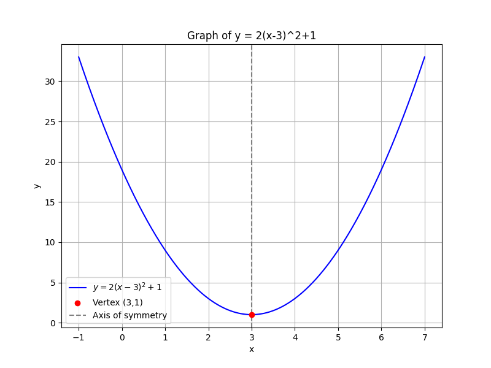

## Graphing Quadratic Functions Using Vertex Form

A quadratic function in vertex form is written as

$$
y = a(x - h)^2 + k,
$$

where

- $$a$$ controls the direction (upward if positive, downward if negative) and the width of the parabola,
- $$(h, k)$$ is the vertex of the parabola, the highest or lowest point.

This form simplifies the graphing process because it clearly shows the transformations applied to the parent function $$y = x^2$$.

### Understanding the Vertex Form

The standard form

$$
y = a(x - h)^2 + k
$$

can be interpreted as:

- **Horizontal Shift:** The value $$h$$ shows how far the graph is shifted horizontally. If $$h > 0$$, the graph moves to the right; if $$h < 0$$, it moves to the left.
- **Vertical Shift:** The value $$k$$ moves the graph vertically. A positive $$k$$ moves the graph up, while a negative $$k$$ moves it down.
- **Vertical Stretch/Compression and Reflection:** The value $$a$$ stretches or compresses the graph. If \(|a| > 1\), the graph is narrower. If \(|a| < 1\), it is wider. A negative $$a$$ reflects the graph over the horizontal axis.

### Step-by-Step Graphing Process

1. **Identify the vertex and coefficient:**
   
   From the function form
   
   $$
y = a(x - h)^2 + k,
   $$
   
   note the vertex is \((h, k)\) and the value of $$a$$.

2. **Plot the vertex:**
   
   Mark the point \((h, k)\) on the coordinate plane. This is the centerpiece of your graph.

3. **Determine the axis of symmetry:**
   
   The line \(x = h\) is the axis of symmetry along which the parabola is mirrored.

4. **Find additional points:**
   
   Choose points on either side of the vertex. Substitute values for $$x$$ into the equation and compute $$y$$ to obtain corresponding coordinates.

5. **Sketch the parabola:**
   
   Draw a smooth curve through the vertex and the calculated points, ensuring that the curve is symmetric about the line \(x = h\).

### Example 1

Graph the quadratic function

$$
y = 2(x - 3)^2 + 1.
$$

**Step 1: Identify the vertex and coefficient**

- Vertex: \((3, 1)\)
- $$a = 2$$ (Parabola opens upward and is narrower than \(y = x^2\)).

**Step 2: Plot the vertex**

Place a point at \((3, 1)\) on the coordinate plane.

**Step 3: Identify the axis of symmetry**

The line is \(x = 3\).

**Step 4: Calculate additional points**

Select values near \(x = 3\):

For \(x = 4\):

$$
y = 2(4 - 3)^2 + 1 = 2(1)^2 + 1 = 2 + 1 = 3.
$$

For \(x = 2\):

$$
y = 2(2 - 3)^2 + 1 = 2(\,-1)^2 + 1 = 2 + 1 = 3.
$$

These points \((4, 3)\) and \((2, 3)\) lie symmetrically on either side of the vertex.

**Step 5: Sketch the graph**

Draw a smooth curve opening upward through \((3, 1)\), \((4, 3)\), and \((2, 3)\).

### Example 2

Graph the quadratic function

$$
y = -\frac{1}{2}(x + 2)^2 + 4.
$$

**Step 1: Rewrite in vertex form**

Notice that \(x + 2\) can be written as \(x - (-2)\). The vertex form is already given:

- Vertex: \((-2, 4)\)
- $$a = -\frac{1}{2}$$ (Parabola opens downward and is wider than \(y = x^2\)).

**Step 2: Plot the vertex**

Place the vertex at \((-2, 4)\) on the coordinate plane.

**Step 3: Identify the axis of symmetry**

The axis is \(x = -2\).

**Step 4: Calculate additional points**

Pick values near \(x = -2\):

For \(x = -1\):

$$
y = -\frac{1}{2}(-1 + 2)^2 + 4 = -\frac{1}{2}(1)^2 + 4 = -\frac{1}{2} + 4 = 3.5.
$$

For \(x = -3\):

$$
y = -\frac{1}{2}(-3 + 2)^2 + 4 = -\frac{1}{2}(-1)^2 + 4 = -\frac{1}{2} + 4 = 3.5.
$$

These points \((-1, 3.5)\) and \((-3, 3.5)\) show symmetry about \(x = -2\).

**Step 5: Sketch the graph**

Draw a downward opening parabola through the vertex \((-2, 4)\) and points \((-1, 3.5)\) and \((-3, 3.5)\).

### Real-World Application

In sports analytics, the vertex form can model the trajectory of a ball. For example, consider a soccer ball kicked into the air. The highest point reached by the ball is modeled by the vertex \((h, k)\) of a quadratic function. Adjusting the value of $$a$$ can simulate different forces, showing a narrower or wider arch.

### Summary of Key Points

> The vertex form $$y = a(x - h)^2 + k$$ reveals the vertex and allows for quick graphing of quadratic functions.

- The vertex \((h, k)\) indicates the maximum or minimum point.
- The sign and magnitude of $$a$$ determine the direction and width of the parabola.
- Graphing is simplified by plotting the vertex and using symmetry to locate other points.

This structured approach is valuable in many practical fields, including physics, engineering, and finance, where understanding the peak or trough of a curve is essential.