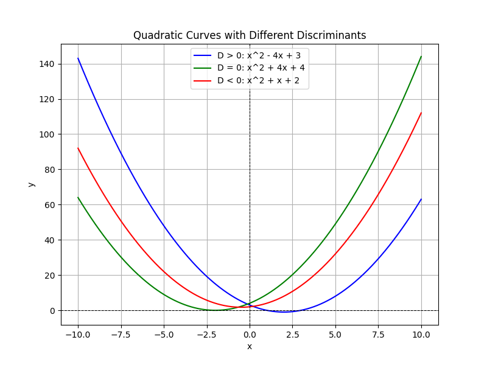

## Analyzing the Discriminant and Nature of Roots

A quadratic equation is commonly written in the form

$$
ax^2 + bx + c = 0,
$$

where $a$, $b$, and $c$ are constants and $a \neq 0$. The expression

$$
D = b^2 - 4ac
$$

is called the discriminant. It provides key information about the equation's solutions (or roots). By evaluating $D$, you can determine whether the solutions are real or complex and whether they are distinct or repeated.

### What Does the Discriminant Tell Us?

The discriminant $D = b^2 - 4ac$ gives insight into three main cases:

- **Case 1: $D > 0$**

  When $D > 0$, the quadratic equation has two distinct real roots. This means the graph of the quadratic function crosses the $x$-axis at two different points. This occurs because the square root of $D$ is a positive number, leading to two different solutions when using the quadratic formula.

- **Case 2: $D = 0$**

  When $D = 0$, the quadratic equation has one real root, also known as a repeated or double root. In this case, the graph touches the $x$-axis at exactly one point (the vertex). The zero value under the square root leads to a single solution.

- **Case 3: $D < 0$**

  When $D < 0$, the quadratic equation has two complex conjugate roots. Since the square root of a negative number introduces the imaginary unit $i$, the equation yields no real solutions, meaning the graph does not intersect the $x$-axis.

### Step-by-Step Analysis

1. **Identify the Coefficients**

   Rewrite the quadratic equation in the standard form

   $$
   ax^2 + bx + c = 0.
   $$

   Determine the values of $a$, $b$, and $c$ from the equation. This step is essential because these coefficients are needed to compute the discriminant.

2. **Calculate the Discriminant**

   Substitute the coefficients into the formula

   $$
   D = b^2 - 4ac.
   $$

   This calculation indicates whether the term under the square root in the quadratic formula is positive, zero, or negative.

3. **Determine the Nature of the Roots**

   Compare $D$ to zero:

   - If $D > 0$, the quadratic has two different real solutions.
   - If $D = 0$, the quadratic has one real solution (a repeated root).
   - If $D < 0$, the quadratic has two complex solutions.

### Example 1: Two Distinct Real Roots

Consider the quadratic equation

$$
x^2 - 4x + 3 = 0.
$$

Identify the coefficients:

- $a = 1$
- $b = -4$
- $c = 3$

Calculate the discriminant:

$$
D = (-4)^2 - 4(1)(3) = 16 - 12 = 4.
$$

Since $D > 0$, there are two distinct real roots. The positive discriminant means that the square root is real and nonzero, ensuring two different answers for $x$.

### Example 2: One Real Root (Repeated)

Examine the equation

$$
x^2 + 4x + 4 = 0.
$$

Identify the coefficients:

- $a = 1$
- $b = 4$
- $c = 4$

Calculate the discriminant:

$$
D = 4^2 - 4(1)(4) = 16 - 16 = 0.
$$

Because $D = 0$, the equation has a single repeated root. In this case, the quadratic can be written as

$$
(x + 2)^2 = 0,
$$

which shows that $x = -2$ is the only solution. The graph of this quadratic touches the $x$-axis at the vertex.

### Example 3: Two Complex Roots

Consider the quadratic equation

$$
x^2 + x + 2 = 0.
$$

Identify the coefficients:

- $a = 1$
- $b = 1$
- $c = 2$

Calculate the discriminant:

$$
D = 1^2 - 4(1)(2) = 1 - 8 = -7.
$$

Since $D < 0$, the quadratic equation has two complex roots. Using the quadratic formula, the solutions are expressed as

$$
x = \frac{-b \pm \sqrt{D}}{2a} = \frac{-1 \pm \sqrt{-7}}{2} = \frac{-1 \pm i\sqrt{7}}{2},
$$

where $i$ denotes the imaginary unit.

### Real-World Applications

Understanding the discriminant is crucial in many fields:

- **Engineering:** In designing structures and systems, engineers often use quadratic equations to model curves. Knowing whether the quadratic function intersects a reference line in two, one, or no real points can influence design choices.

- **Finance:** Quadratic equations are used to model profit and cost functions. The number and type of roots can indicate break-even points and help in making critical financial decisions.

- **Sports Analytics:** In projectile motion problems, such as determining the maximum height of a thrown ball, the discriminant helps establish when and how the ball reaches certain heights. This understanding can be applied to optimize performance and strategies.

By analyzing the discriminant, you quickly understand the behavior of a quadratic equation without solving it fully. This method not only saves time in academic settings but also provides valuable insights in practical, real-world problems.