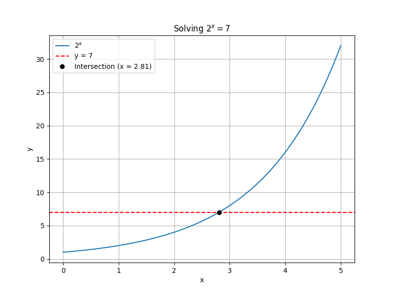
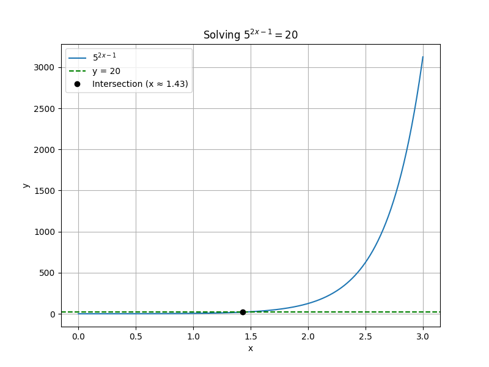

## Solving Exponential Equations Using Logarithms

Exponential equations are equations where the variable appears in the exponent. When the bases cannot be easily rewritten as the same number, logarithms provide a systematic method to solve these equations. This lesson explains how to use logarithms step by step to determine the unknown exponent, with detailed explanations to solidify your understanding.

### Understanding the Process

An exponential equation has the form

$$
a^{f(x)} = b,
$$

where $a$ and $b$ are positive constants and $f(x)$ is an expression involving the variable. The basic idea is to isolate the exponential expression and then use logarithms to "bring down" the exponent. This is possible because logarithms are the inverse operation of exponentiation.

To solve for $x$, follow these steps:

1. Isolate the exponential expression.
2. Apply a logarithm to both sides. Common choices are the natural logarithm $\ln$ or the common logarithm $\log$.
3. Use the logarithm power rule: $$\log(a^c) = c\log(a).$$ This rule lets you move the exponent in front of the logarithm.
4. Solve the resulting linear equation for $x$.

> Logarithms reverse the process of exponentiation. They allow you to transform an exponential equation into a linear one by converting the exponent into a coefficient.

### Example 1: Solving a Basic Exponential Equation

Consider the equation

$$
2^x = 7.
$$

This equation does not allow writing both sides with the same base. Therefore, we use logarithms.

#### Step 1: Apply the Natural Logarithm

Take the natural logarithm of both sides to obtain

$$
\ln(2^x) = \ln(7).
$$

Taking logarithms preserves the equality and sets up the equation for applying the logarithm power rule.

#### Step 2: Use the Power Rule

Using the power rule, move the exponent $x$ in front of the logarithm:

$$
x\ln(2) = \ln(7).
$$

This step transforms the exponential equation into a linear one in terms of $x$.

#### Step 3: Solve for $x$

Divide both sides by $\ln(2)$ to isolate $x$:

$$
x = \frac{\ln(7)}{\ln(2)}.
$$

This is the exact solution. For a numerical approximation, compute the values of $\ln(7)$ and $\ln(2)$.

### Example 2: Solving a More Involved Equation

Now, consider the equation

$$
5^{2x-1} = 20.
$$

This equation involves a more complex exponent, but the process remains the same.

#### Step 1: Apply the Natural Logarithm

Take the natural logarithm of both sides:

$$
\ln(5^{2x-1}) = \ln(20).
$$

This step sets up the equation for application of the power rule.

#### Step 2: Use the Power Rule

Bring the exponent $(2x-1)$ down in front of the logarithm:

$$
(2x-1)\ln(5) = \ln(20).
$$

This conversion simplifies the expression by transforming the exponential term into a linear term.

#### Step 3: Isolate the Variable Term

Divide both sides by $\ln(5)$ to isolate the term containing $x$:

$$
2x - 1 = \frac{\ln(20)}{\ln(5)}.
$$

#### Step 4: Solve for $x$

Add $1$ to both sides and then divide by $2$:

$$
2x = \frac{\ln(20)}{\ln(5)} + 1,
$$

$$
x = \frac{1}{2}\left(\frac{\ln(20)}{\ln(5)} + 1\right).
$$

This result is the exact solution of the equation.

### Real-World Application

Exponential equations are commonly used in financial calculations, such as compound interest. For example, the formula for continuous compound interest is

$$
A = Pe^{rt},
$$

where $A$ is the amount of money accumulated after time $t$, $P$ is the principal amount, $r$ is the interest rate, and $t$ is time.

To solve for the time $t$ when an investment grows to a certain amount $A$, follow these steps:

1. Divide both sides by $P$:

$$
e^{rt} = \frac{A}{P}.
$$

2. Take the natural logarithm of both sides:

$$
\ln(e^{rt}) = \ln\left(\frac{A}{P}\right).
$$

3. Apply the power rule:

$$
rt = \ln\left(\frac{A}{P}\right).
$$

4. Solve for $t$:

$$
t = \frac{\ln\left(\frac{A}{P}\right)}{r}.
$$

This application shows how logarithms are essential in determining the time required for an investment to reach a target value.

### Summary of Key Steps

- Isolate the exponential expression.
- Take the logarithm of both sides.
- Use the property $\log(a^c) = c\log(a)$ to simplify the equation.
- Solve the resulting linear equation for the variable.

This method is a powerful tool for solving exponential equations, especially when direct comparison of bases is not feasible.