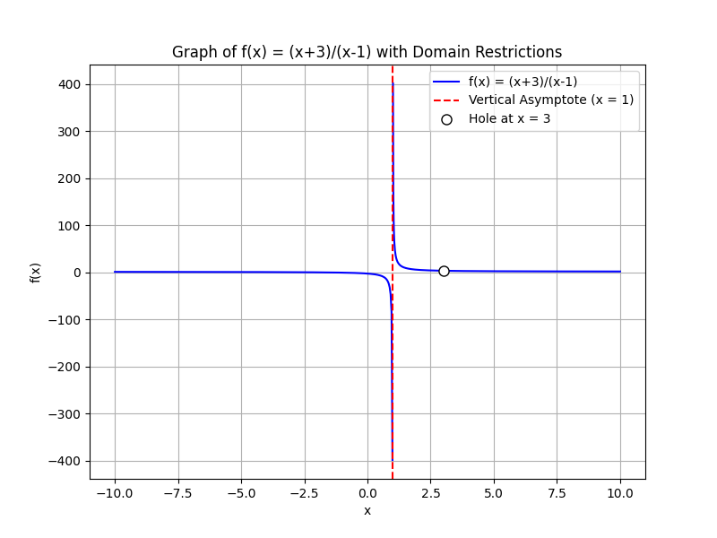

## Simplifying Rational Expressions and Identifying Domain Restrictions

In this lesson we will learn two important ideas:

1. How to simplify rational expressions by factoring and canceling common factors.

2. How to determine domain restrictions, which are the values of the variable that would make the denominator zero.

Rational expressions are fractions with polynomials in the numerator and denominator. Simplifying them makes problems easier to solve and understand.

### Key Concepts

> A domain restriction is a value that is not allowed because it makes a denominator zero.

> Simplifying a rational expression involves factoring both the numerator and denominator and then canceling any common factors. It is important to note these canceled factors become restrictions on the domain.

### Step-by-Step Process

1. **Factor the Numerator and Denominator:** Write each polynomial as a product of its factors.

2. **Identify Domain Restrictions:** Set each factor in the denominator equal to zero and solve for the variable. These are the values that cannot be used.

3. **Cancel Common Factors:** Cancel any factor that appears in both the numerator and denominator. Remember, the restrictions still apply even if the factor is canceled.

4. **Write the Simplified Expression:** The resulting expression is simplified but must include the domain restrictions.

### Example 1

Simplify the expression: 

$$
\frac{6x^2 - 12x}{3x}
$$

**Step 1: Factor the Numerator**

The numerator can be factored by taking out the greatest common factor (GCF):

$$
6x^2 - 12x = 6x(x - 2)
$$

The denominator is already in factored form: 

$$3x$$

**Step 2: Identify Domain Restrictions**

Set the denominator equal to zero:

$$
3x = 0 \quad\Longrightarrow\quad x = 0
$$

So, $x \neq 0$.

**Step 3: Cancel Common Factors**

Cancel the common factor $3x$ (note that $6x = 3x \cdot 2$):

$$
\frac{6x(x - 2)}{3x} = 2(x - 2) \quad \text{for } x \neq 0
$$

**Final Simplified Expression:**

$$
2(x - 2) \quad \text{with } x \neq 0
$$

### Example 2

Simplify the expression:

$$
\frac{x^2 - 9}{x^2 - 4x + 3}
$$

**Step 1: Factor Both Polynomials**

The numerator $x^2 - 9$ is a difference of squares:

$$
x^2 - 9 = (x - 3)(x + 3)
$$

Factor the denominator $x^2 - 4x + 3$:

Find two numbers that multiply to $3$ and add to $-4$. These numbers are $-1$ and $-3$.

$$
x^2 - 4x + 3 = (x - 1)(x - 3)
$$

**Step 2: Identify Domain Restrictions**

Set the denominator equal to zero:

$$
(x - 1)(x - 3) = 0 \quad\Longrightarrow\quad x = 1 \text{ or } x = 3
$$

Thus, $x \neq 1$ and $x \neq 3$.

**Step 3: Cancel Common Factors**

The factor $(x - 3)$ appears in both numerator and denominator and can be canceled (provided $x \neq 3$):

$$
\frac{(x - 3)(x + 3)}{(x - 1)(x - 3)} = \frac{x + 3}{x - 1} \quad \text{for } x \neq 1 \text{ and } x \neq 3
$$

**Final Simplified Expression:**

$$
\frac{x + 3}{x - 1} \quad \text{with } x \neq 1 \text{ and } x \neq 3
$$

### Important Notes

- Always factor completely. Missing a factor can lead to an incorrect expression or overlooked domain restrictions.

- Even after canceling factors, keep the original restrictions. The simplified expression is not defined for those values.

- Check your work by considering the value of $x$ near the restrictions to confirm the behavior of the original expression.

This lesson provides the framework to simplify rational expressions and correctly identify the values for which the expression is undefined.