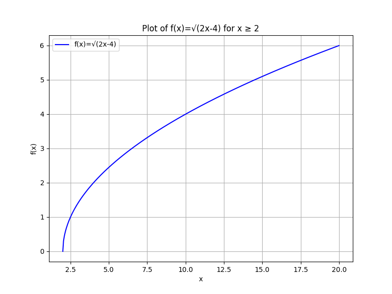

## Understanding Radical Functions and Nth Roots

Radical functions are functions that involve roots, such as square roots, cube roots, or more generally, nth roots. These functions are written in the form

$$
f(x) = \sqrt[n]{x} = x^{1/n},
$$

where $n$ is a positive integer. When $n = 2$, the function is a square root function; when $n = 3$, it is a cube root function, and so on. Expressing the radical in exponent form is often useful because it allows us to apply exponent rules during algebraic manipulations.

### Key Definitions and Concepts

1. > A radical function involves any expression that contains a root. For example, $f(x) = \sqrt{x - 2}$ is a radical function. This definition highlights that the presence of a root is the key characteristic of these functions.

2. > An nth root is expressed as $\sqrt[n]{a}$ and is equivalent to raising $a$ to the power of $1/n$, i.e. $a^{1/n}$. This form can simplify the process of differentiation, integration, and algebraic manipulation.

3. **Even-Indexed Roots:** When $n$ is even (such as 2, 4, 6, ...), the radicand—the expression under the radical sign—must be nonnegative. For instance, consider

$$
f(x) = \sqrt{x - 1}.
$$

Since the expression inside the square root must be zero or positive, we set

$$
x - 1 \ge 0 \quad\Longrightarrow\quad x \ge 1.
$$

This condition avoids undefined or complex outputs in the context of real numbers.

4. **Odd-Indexed Roots:** When $n$ is odd (such as 3, 5, 7, ...), the radicand can be negative, zero, or positive. For example, the function

$$
g(x) = \sqrt[3]{x - 3}
$$

has a domain of all real numbers. Odd roots are defined for negative numbers because the cube of a negative number remains negative.

### Step-by-Step Example: Analyzing a Radical Function

Consider the function

$$
f(x) = \sqrt{2x - 4}.
$$

This example demonstrates how to determine the domain based on the restrictions imposed by the radical.

**Step 1: Identify the Radicand and Its Restrictions**

The radicand here is $2x - 4$. Since we have a square root (an even-indexed radical), the expression inside must be nonnegative to ensure the function is defined for real numbers. Therefore, we set up the inequality:

$$
2x - 4 \ge 0.
$$

This step establishes a restriction on $x$ based on the property of square roots.

**Step 2: Solve for $x$**

Add 4 to both sides of the inequality:

$$
2x \ge 4.
$$

Divide both sides by 2:

$$
x \ge 2.
$$

Thus, the domain of $f(x)$ is given by $x \ge 2$. This indicates that only values of $x$ starting from 2 and increasing are valid.

**Step 3: Graphing Consideration**

When graphing $f(x) = \sqrt{2x - 4}$, you only plot the function for $x \ge 2$. The graph begins at $x = 2$, where the radicand equals zero, and then rises gradually as $x$ increases. This visual starting point reinforces the importance of domain restrictions for radical functions.

### Step-by-Step Example: Using an Nth Root Function (Odd Index)

Examine the function

$$
g(x) = \sqrt[3]{x - 3}.
$$

This example illustrates the difference in domain restrictions when the radical index is odd.

**Step 1: Determine the Domain**

Since the cube root is an odd-indexed function, there is no restriction on the radicand; it can be negative, zero, or positive. Therefore, the domain of $g(x)$ is all real numbers. This property allows the function to accept every possible real value for $x$.

**Step 2: Evaluate the Function at Selected Points**

To build intuition, consider the following evaluations:

- For $x = 3$:

  $$
g(3) = \sqrt[3]{3 - 3} = \sqrt[3]{0} = 0.
  $$

  This shows that the function passes through the point $(3,0)$.

- For $x = 10$:

  $$
g(10) = \sqrt[3]{10 - 3} = \sqrt[3]{7} \quad \text{(approximately } 1.91\text{)}.
  $$

- For $x = 0$:

  $$
g(0) = \sqrt[3]{0 - 3} = \sqrt[3]{-3} \quad \text{(approximately } -1.44\text{)}.
  $$

Evaluating the function at these points gives a clear picture of the behavior of cube root functions, which can handle negative inputs without any issues.

### Properties and Real-World Applications

1. **Simplification and Expression:**

   Radical expressions can often be rewritten in exponent form. For example, the fourth root of $x^3$ can be expressed as
   
   $$
   \sqrt[4]{x^3} = x^{3/4}.
   $$
   
   This conversion is useful in both simplifying expressions and performing further algebraic operations.

2. **Domain Considerations:**

   Many real-world problems, such as those involving distances, areas, or dimensions, require inputs that make sense in context. For even-indexed roots, ensuring that the radicand is nonnegative is crucial. For instance, calculating the side length of a geometric figure using the Pythagorean theorem involves a square root, and a negative input would not make sense in a physical context.

3. **Modeling with Radical Functions:**

   Radical functions are useful in various fields. In physics, they can model relationships like those for velocity and energy. In engineering, radical functions help with material stress and scaling problems. In finance, they may appear in models related to growth rates. Recognizing and applying the correct domain restrictions ensures that these models yield practical and accurate results.

### Summary of Key Points

- Radical functions involve roots and are typically written as
  
  $$
f(x)=\sqrt[n]{x}.
  $$
  
- For even-indexed radicals, the expression under the root must be nonnegative, while odd-indexed radicals allow all real numbers as input.

- Converting radicals to exponent form, such as $x^{1/n}$, simplifies further mathematical operations.

- Understanding the domain and behavior of radical functions is essential, especially when applying these functions to real-world scenarios.

This lesson has presented the fundamental ideas behind radical functions and nth roots with detailed, step-by-step examples. Mastery of these concepts will help you analyze more advanced functions and solve problems involving radical expressions.

![Line plot of $g(x)=\sqrt[3]{x-3}$ for a range of $x$ values, illustrating cube root behavior.](images/plot_2_07-03-lesson-understanding-radical-functions-and-nth-roots.md.png)