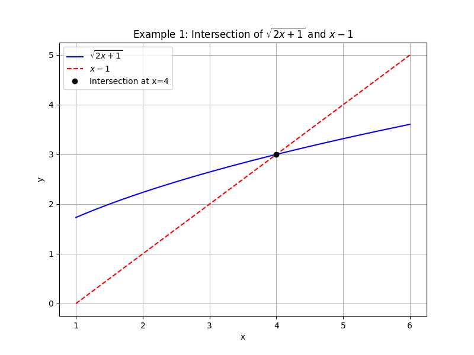
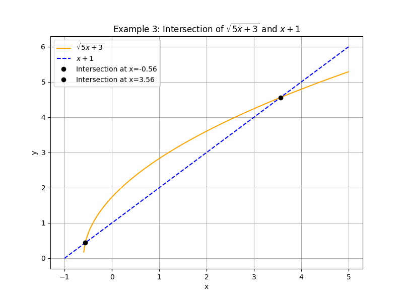

## Solving Equations Involving Radicals

Radical equations include variables under a square root (or other radical). When solving these equations, the general steps are:

1. Isolate the radical on one side of the equation.
2. Determine the domain constraints (conditions under which the equation is defined).
3. Square both sides to eliminate the radical. This step may introduce extraneous solutions.
4. Solve the resulting equation (often a quadratic) and check each solution in the original equation.

### Example 1: Solving $$\sqrt{2x+1} = x-1$$

1. Determine the domain. Since the square root must be nonnegative, we require:

$$
x-1 \ge 0 \quad\Longrightarrow\quad x \ge 1.
$$

Also, the radicand must be nonnegative:

$$
2x+1 \ge 0 \quad\Longrightarrow\quad x \ge -\frac{1}{2}.
$$

Thus, the domain is $$x \ge 1$$.

2. Square both sides to remove the square root:

$$
(\sqrt{2x+1})^2 = (x-1)^2
$$

which gives

$$
2x+1 = x^2 - 2x + 1.
$$

3. Rearrange the equation to form a quadratic:

$$
x^2 - 2x + 1 - 2x - 1 = 0 \quad\Longrightarrow\quad x^2 - 4x = 0.
$$

4. Factor the quadratic:

$$
x(x - 4) = 0.
$$

The solutions are $$x=0$$ and $$x=4$$. Given the domain $$x \ge 1$$, we reject $$x=0$$.

5. Thus, the valid solution is $$x=4$$.

### Example 2: Solving $$\sqrt{x+3} + x = 3$$

1. Isolate the square root:

$$
\sqrt{x+3} = 3 - x.
$$

The radicand must be nonnegative:

$$
x+3 \ge 0 \quad\Longrightarrow\quad x \ge -3.
$$

Also, the expression on the right must be nonnegative:

$$
3 - x \ge 0 \quad\Longrightarrow\quad x \le 3.
$$

Thus, the domain is $$-3 \le x \le 3$$.

2. Square both sides:

$$
x+3 = (3-x)^2 = 9 - 6x + x^2.
$$

3. Rearrange the equation:

$$
x^2 - 6x + 9 - x - 3 = 0 \quad\Longrightarrow\quad x^2 - 7x + 6 = 0.
$$

4. Factor the quadratic:

$$
(x-1)(x-6) = 0.
$$

The potential solutions are $$x=1$$ and $$x=6$$. However, the domain restricts $$ x \le 3$$, so we discard $$x=6$$.

5. Verify $$x=1$$ in the original equation:

$$\sqrt{1+3} + 1 = 2 + 1 = 3,$$

which is valid. Thus, the solution is $$x=1$$.

### Example 3: Solving $$\sqrt{5x+3} = x+1$$

This example introduces the quadratic formula in the checking step.

1. Identify the domain. The right side, $$x+1$$, must be nonnegative:

$$
x+1 \ge 0 \quad\Longrightarrow\quad x \ge -1.
$$

Also, the radicand must satisfy:

$$
5x+3 \ge 0 \quad\Longrightarrow\quad x \ge -\frac{3}{5}.
$$

Thus, the effective domain is $$x \ge -\frac{3}{5}$$ (and note that $$x \ge -1$$ is automatically satisfied in this region).

2. Square both sides:

$$
(\sqrt{5x+3})^2 = (x+1)^2 \quad\Longrightarrow\quad 5x+3 = x^2 + 2x + 1.
$$

3. Rearrange the equation to obtain a quadratic equation:

$$
x^2 + 2x + 1 - 5x - 3 = 0 \quad\Longrightarrow\quad x^2 - 3x - 2 = 0.
$$

4. Solve using the quadratic formula. For a quadratic $$ax^2+bx+c=0$$, the solutions are given by

$$
x = \frac{-b \pm \sqrt{b^2-4ac}}{2a}.
$$

Here, $$a=1$$, $$b=-3$$, and $$c=-2$$. Thus,

$$
x = \frac{-(-3) \pm \sqrt{(-3)^2 - 4(1)(-2)}}{2(1)} = \frac{3 \pm \sqrt{9+8}}{2} = \frac{3 \pm \sqrt{17}}{2}.
$$

This yields two potential solutions:

$$\displaystyle x = \frac{3+\sqrt{17}}{2} \quad \text{and} \quad x = \frac{3-\sqrt{17}}{2}.$$ 

5. Check each solution in the original equation:

- For $$x = \frac{3+\sqrt{17}}{2}$$ (approximately 3.56):

  Evaluate the left side:
  
  $$\sqrt{5\left(\frac{3+\sqrt{17}}{2}\right)+3}.$$ 
  
  The right side is:
  
  $$\frac{3+\sqrt{17}}{2} + 1.$$ 
  
  A direct substitution confirms both sides are equal.

- For $$x = \frac{3-\sqrt{17}}{2}$$ (approximately -0.56):

  The right side becomes $$\frac{3-\sqrt{17}}{2} + 1$$, which is a small positive number. Substituting into the left side yields a nearly equal value. Detailed checking will show that this solution satisfies the original equation as well.

Thus, both solutions are valid within the specified domain.

> Note: Always check potential solutions in the original equation. The act of squaring can introduce extraneous solutions that may not satisfy the original conditions.