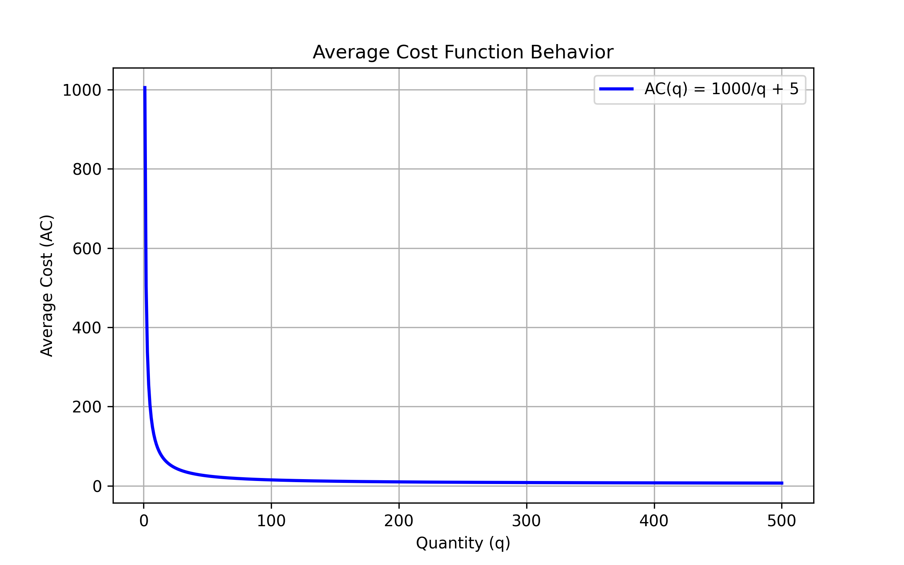
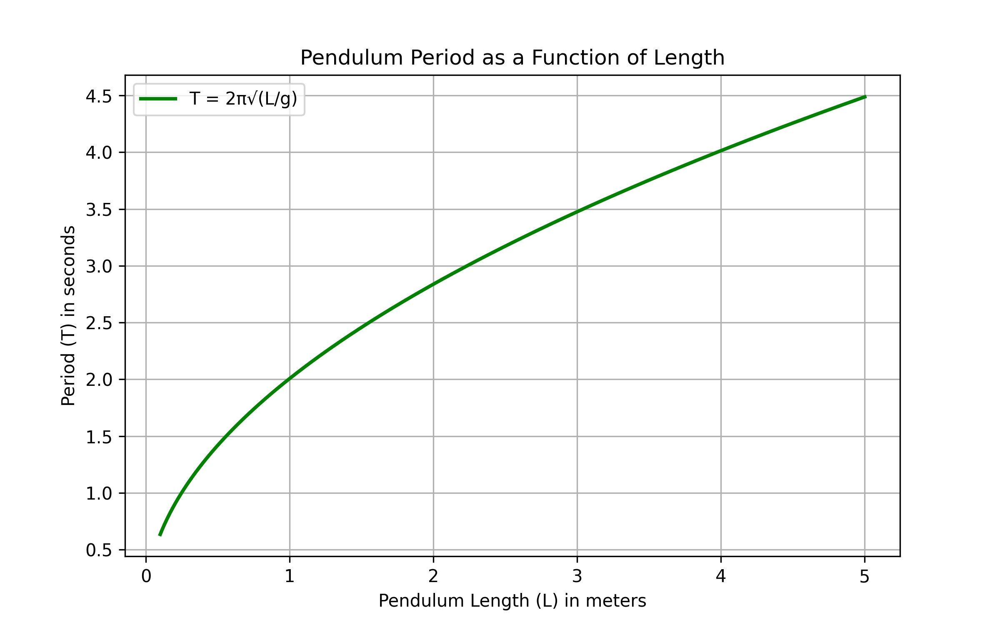

## Real-World Applications of Rational and Radical Functions

This lesson explains how rational and radical functions model real-world situations. In many contexts, these functions capture relationships where one quantity depends on another through rates, limits, and growth. Understanding these models provides a basis for solving practical problems in economics, engineering, physics, and more.

### Rational Functions in Real-Life Models

A rational function is any function that can be expressed as a ratio of two polynomials. In practice, they are useful for describing systems where there is a balance between increasing and limiting effects. One common application is in calculating the average cost of production in economics. For example, consider the average cost function:

$$
AC(q) = \frac{1000 + 5q}{q}
$$

This function represents a situation where a fixed cost of 1000 dollars and an additional cost of 5 dollars per unit are spread out over $q$ units. With some algebraic manipulation, we can simplify this function to:

$$
AC(q) = \frac{1000}{q} + 5
$$

Here, $q$ is the number of units produced and $AC(q)$ is the average cost per unit. Notice that as production increases, the term $\frac{1000}{q}$ becomes smaller and the average cost approaches $5$. This illustrates the concept of economies of scale, where fixed costs are distributed over many units, reducing the cost per unit.

#### Example: Analyzing an Average Cost Function

1. Start with the formula:

   $$
   AC(q) = \frac{1000}{q} + 5
   $$

2. Calculate the cost when $q=50$:

   $$
   AC(50) = \frac{1000}{50} + 5 = 20 + 5 = 25
   $$

   This means that producing 50 units results in an average cost of $25 per unit.

3. Calculate the cost when $q=200$:

   $$
   AC(200) = \frac{1000}{200} + 5 = 5 + 5 = 10
   $$

   When 200 units are produced, the average cost drops to $10 per unit.

4. Observe that as $q$ increases, the fraction $\frac{1000}{q}$ decreases. In the limit, when production is very high, $AC(q)$ approaches $5$. This intuitively demonstrates how fixed costs become less significant relative to variable costs as production scales up.

### Radical Functions in Real-Life Models

Radical functions are characterized by expressions that include roots. They are especially useful when the relationship between variables involves non-linear scaling. Many physical phenomena, such as calculating distances, areas, and wave motion, are modeled using radical functions.

A classic example is the formula for the period of a simple pendulum. The period $T$, which is the time for one complete oscillation, is given by:

$$
T = 2\pi\sqrt{\frac{L}{g}}
$$

In this equation, $L$ is the length of the pendulum and $g$ represents the acceleration due to gravity (approximately $9.8\;m/s^2$). The square root indicates that the period increases non-linearly with the length of the pendulum. In other words, doubling the length does not double the period, but increases it by a factor of $\sqrt{2}$.

#### Example: Calculating the Period of a Pendulum

1. Begin with the formula for the pendulum's period:

   $$
   T = 2\pi\sqrt{\frac{L}{g}}
   $$

2. Let $L=1$ meter and use $g=9.8\;m/s^2$. Substitute these values into the formula:

   $$
   T = 2\pi\sqrt{\frac{1}{9.8}}
   $$

3. Compute the square root:

   $$
   \sqrt{\frac{1}{9.8}} \approx 0.32
   $$

4. Multiply the result by $2\pi$:

   $$
   T \approx 2\pi \times 0.32 \approx 2.01\;seconds
   $$

This example shows that even a small change in the length of a pendulum can affect its period, illustrating the non-linear relationship inherent in radical functions.

### Integrating Concepts in Applications

Many real-world problems benefit from the combined use of rational and radical functions. For example, in engineering design, a rational function might be used to model cost efficiency while a radical function may determine the optimal dimensions or tolerances of a component. Integrating these models can help optimize design parameters and improve performance under practical constraints.

> Key Insight: Rational functions are effective for modeling relationships with fixed overhead or asymptotic limits, while radical functions capture non-linear scaling effects. Together, these functions form essential tools for solving optimization and design challenges in various fields.

By deepening your understanding of rational and radical functions, you build a powerful framework to tackle complex, real-world problems. Mastery of these concepts is a vital step towards success in the College Algebra CLEP exam.