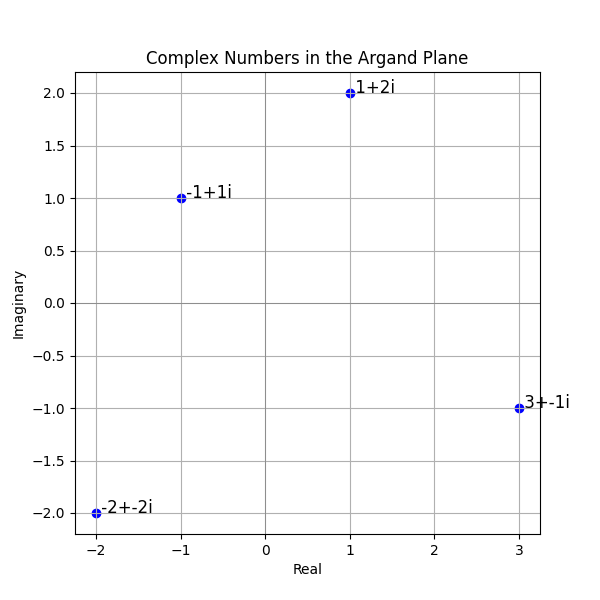

# Complex Numbers and Conic Sections

This unit introduces two major topics in advanced algebra: complex numbers and conic sections.

Complex numbers extend our number system, allowing us to solve equations that have no real solutions. They consist of a real part and an imaginary part, and mastering their operations is essential for higher-level mathematics and applications in engineering and physics.

Conic sections are the curves obtained by intersecting a plane with a double-napped cone. This unit covers the equations and properties of circles, parabolas, ellipses, and hyperbolas. Understanding conic sections is crucial for modeling real-world phenomena, from the paths of celestial bodies to design in architecture and engineering.

By exploring these topics, you will learn not only to perform calculations but also to apply these concepts in practical situations such as electronic circuit design and analyzing satellite orbits.

> Complex numbers open portals to unseen dimensions, where the imaginary breathes life into profound truths.