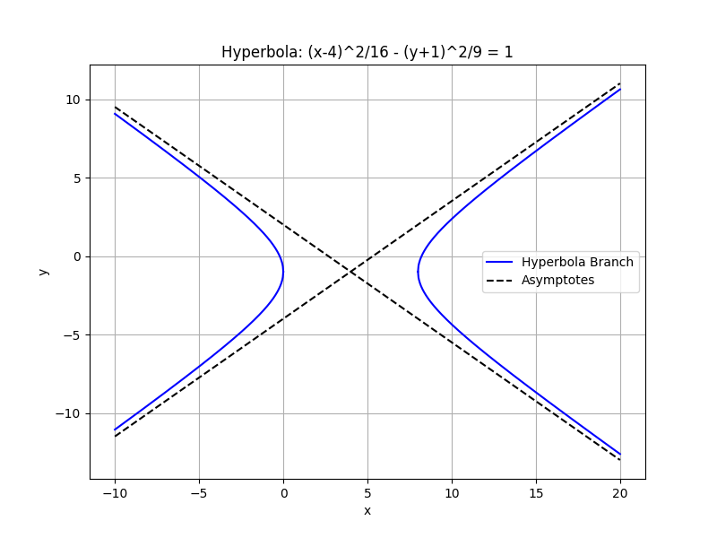

## Graphing Parabolas, Circles, Ellipses, and Hyperbolas

In this lesson, you will learn how to graph four important types of conic sections: parabolas, circles, ellipses, and hyperbolas. Understanding and graphing these conic sections is essential as they appear in various scientific and engineering applications, from satellite dish designs to planetary orbits.

### Parabolas

A parabola is a U-shaped curve that can open up, down, left, or right. The standard equation for a parabola can be written as:

- **Vertical Parabola:** $y = ax^2 + bx + c$
- **Horizontal Parabola:** $x = ay^2 + by + c$

**Example:** Graph the parabola given by $y = 2x^2 - 4x + 1$.

1. **Identify the Vertex:**
   - The vertex formula for $y = ax^2 + bx + c$ is given by:
     $$x = \frac{-b}{2a}$$
   - For $a = 2, b = -4$, calculate $x = \frac{-(-4)}{2 \times 2} = 1$.
   - Substitute $x = 1$ into the equation to find $y$:
     $$y = 2(1)^2 - 4(1) + 1 = -1$$
   - Therefore, the vertex is $(1, -1)$.

2. **Find the Axis of Symmetry:**
   - The axis of symmetry for the parabola is the vertical line $x = 1$.

3. **Calculate Additional Points:**
   - Choose $x$-values around the vertex, such as $x = 0$ and $x = 2$.
   - Find corresponding $y$-values:
     - For $x=0$, $y = 2(0)^2 - 4(0) + 1 = 1$
     - For $x=2$, $y = 2(2)^2 - 4(2) + 1 = 1$

4. **Plot and Draw the Parabola:**
   - Plot the points $(1,-1)$, $(0,1)$, and $(2,1)$. 
   - Sketch the curve passing through these points, ensuring symmetry around the axis.

### Circles

A circle is the set of all points equidistant from a fixed center point. The standard form equation of a circle is:
$$ (x - h)^2 + (y - k)^2 = r^2 $$ where $(h, k)$ is the center, and $r$ is the radius.

**Example:** Graph the circle with center $(2, -3)$ and radius $5$.

1. **Use the Standard Form Equation:**
   - Plug into the formula: 
     $$(x - 2)^2 + (y + 3)^2 = 25$$

2. **Identify Key Points:**
   - Start at the center $(2, -3)$.
   - Radius $5$ indicates points at $(2+5,-3), (2-5,-3), (2,-3+5), (2,-3-5)$.

3. **Plot the Points and Draw the Circle:**
   - Plot the center and all points at the radius distance.
   - Draw the circle connecting the edge points smoothly.

### Ellipses

An ellipse looks like a stretched circle, with two focal points. The standard form for horizontal and vertical ellipses are:

- **Horizontal Ellipse:** $\frac{(x-h)^2}{a^2} + \frac{(y-k)^2}{b^2} = 1$
- **Vertical Ellipse:** $\frac{(x-h)^2}{b^2} + \frac{(y-k)^2}{a^2} = 1$

where $(h, k)$ is the center, and $a$ and $b$ are the semi-major and semi-minor axes.

**Example:** Graph the ellipse $\frac{(x-1)^2}{9} + \frac{(y+2)^2}{4} = 1$.

1. **Identify Center and Axes:**
   - Center: $(1, -2)$, $a^2 = 9$, $b^2 = 4$. Thus $a = 3$, $b = 2$.

2. **Plot Focal Points and Axes:**
   - Semi-major axis along the x-axis: $x = 1 \pm 3$.
   - Semi-minor axis along the y-axis: $y = -2 \pm 2$.
   - Foci calculation: $c = \sqrt{a^2 - b^2} = \sqrt{9 - 4} = \sqrt{5}$.

3. **Draw the Ellipse:**
   - Draw an oval shape stretching through the axes lengths.

### Hyperbolas

Hyperbolas look like two mirrored curves and have a central axis between them. The equations of hyperbolas are:

- **Horizontal Hyperbola:** $\frac{(x-h)^2}{a^2} - \frac{(y-k)^2}{b^2} = 1$
- **Vertical Hyperbola:** $\frac{(y-k)^2}{a^2} - \frac{(x-h)^2}{b^2} = 1$

**Example:** Graph the hyperbola $\frac{(x-4)^2}{16} - \frac{(y+1)^2}{9} = 1$.

1. **Identify Center and Directions:**
   - Center: $(4, -1)$. Horizontal because the $x$ term is positive.

2. **Calculate the Asymptotes:**
   - Use the formula for asymptotes: $y = k \pm \frac{b}{a}(x-h)$. Here $a^2 = 16$, $b^2 = 9$, so $a = 4$, $b = 3$.
   - Asymptotes: $y = -1 \pm \frac{3}{4}(x-4)$.

3. **Plot and Sketch the Hyperbola:**
   - Identify vertices ($x = 4 \pm 4$ on the x-axis, passing through focal points at calculated distance $c = \sqrt{a^2 + b^2}$).
   - Sketch branches opening along asymptotes.

These techniques ensure you graph conic sections accurately. Use these steps to analyze and construct any conic section for various real-world applications such as designing satellite dishes or architecting large structures for optimal stress distribution.