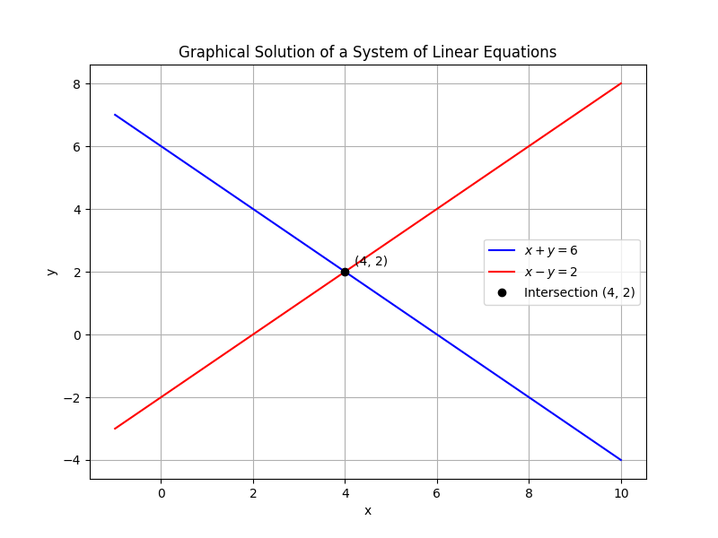

## Solving Systems of Linear Equations by Substitution

This lesson explains a method for solving systems of two linear equations by substitution. In this method, you solve one equation for one variable and substitute that expression into the other equation. This reduces the system to a single equation with one unknown, which you can solve directly.

### Step 1: Write the Equations in Standard Form

Ensure both equations are written so that like terms are aligned. A common format is:

$$
a_1x + b_1y = c_1
$$

$$
a_2x + b_2y = c_2
$$

### Step 2: Isolate One Variable

Choose one of the equations and solve for one variable in terms of the other. For example, if you have:

$$
x + y = 6,
$$

you can solve for $y$:

$$
y = 6 - x.
$$

This expression will replace $y$ in the other equation.

### Step 3: Substitute into the Other Equation

Take the expression for the isolated variable and substitute it into the other equation. For instance, if the second equation is:

$$
x - y = 2,
$$

substitute $y = 6 - x$:

$$
x - (6 - x) = 2.
$$

Be sure to correctly distribute any negative signs when substituting.

### Step 4: Solve for the Remaining Variable

Simplify the substituted equation. Continuing the example:

$$
x - 6 + x = 2,
$$

Combine like terms:

$$
2x - 6 = 2.
$$

Add 6 to both sides:

$$
2x = 8,
$$

and then divide by 2:

$$
x = 4.
$$

### Step 5: Substitute Back to Find the Other Variable

Use the found value to substitute back into the isolated expression. Here, substitute $x = 4$ into $y = 6 - x$:

$$
y = 6 - 4 = 2.
$$

### Step 6: Verify the Solution

It is important to check that the solution satisfies both original equations. The solution $x = 4$ and $y = 2$ should work in both:

1. Substitute into $x + y = 6$: $$4 + 2 = 6.$$ 

2. Substitute into $x - y = 2$: $$4 - 2 = 2.$$ 

Since both equations are true, the solution is correct.

### Summary Example

Let’s review the complete process with our example:

1. Start with the system:

   $$
   x + y = 6,
   $$
   $$
   x - y = 2.
   $$

2. Isolate $y$ in the first equation:

   $$
   y = 6 - x.
   $$

3. Substitute into the second equation:

   $$
   x - (6 - x) = 2.
   $$

4. Simplify and solve for $x$:

   $$
   2x - 6 = 2 
   $$
   $$
   2x = 8 
   $$
   $$
   x = 4.
   $$

5. Substitute $x = 4$ back to find $y$:

   $$
   y = 6 - 4 = 2.
   $$

6. Verify the solution:

   $$
   4 + 2 = 6 
   $$
   $$
   4 - 2 = 2.
   $$

This step-by-step process using substitution handles many problems involving two variables.

### Additional Example

Consider the following system:

$$
2x + 3y = 12,
$$
$$
x - y = 1.
$$

**Step 1:** Isolate $x$ in the second equation:

$$
x = 1 + y.
$$

**Step 2:** Substitute $x = 1 + y$ into the first equation:

$$
2(1 + y) + 3y = 12.
$$

**Step 3:** Simplify and solve for $y$:

$$
2 + 2y + 3y = 12,
$$

$$
5y + 2 = 12,
$$

Subtract 2 from both sides:

$$
5y = 10,
$$

Divide by 5:

$$
y = 2.
$$

**Step 4:** Substitute $y = 2$ back into $x = 1 + y$:

$$
x = 1 + 2 = 3.
$$

**Step 5:** Verify the solution:

Substitute into the first equation:

$$
2(3) + 3(2) = 6 + 6 = 12.
$$

Substitute into the second equation:

$$
3 - 2 = 1.
$$

Both equations check out, so the solution is $x = 3$, $y = 2$.

This method is effective for systems where one equation can be easily solved for one variable. Keep in mind the careful distribution of negative signs and proper use of parentheses during substitution to avoid errors.