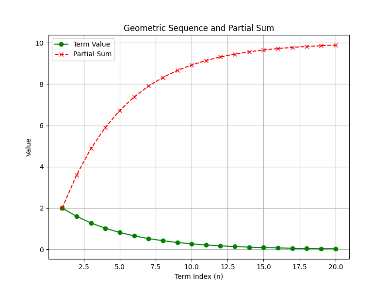
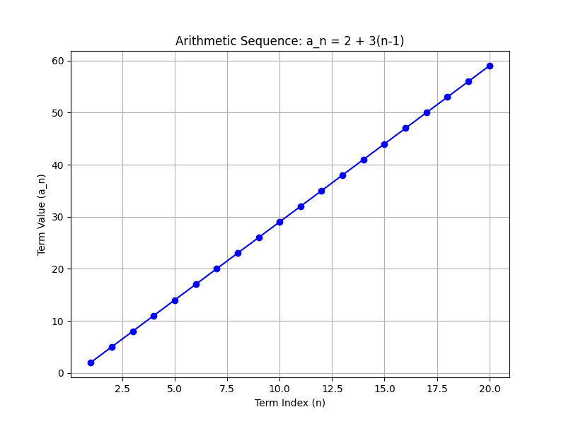

# Sequences, Series, and Advanced Topics

This unit introduces sequences and series, exploring both arithmetic and geometric patterns along with advanced topics. It explains how to identify these patterns, derive formulas for their sums, and apply these concepts to real-world scenarios in finance, engineering, and scientific analysis.

Understanding sequences and series is crucial because they provide a methodical approach to describe patterns and solve problems that involve repetition and accumulation. The concepts learned in this unit will help learners model real-world situations such as computing interest, analyzing population growth, and understanding hierarchical structures in data.

In this unit, you will see step-by-step examples that illustrate how to determine the common difference or ratio, find the nth term of a sequence, and calculate the sum of series. Each example is designed to build a solid foundation for advanced algebraic methods, ensuring you are well-prepared for complex problem-solving on the College Algebra CLEP exam.

> Sequences trace the heartbeat of mathematics—each term a step in an endless journey—while series weave these beats into a tapestry of infinite discovery.

Be prepared to engage with detailed examples, clear explanations, and structured problem-solving steps that connect abstract concepts to practical applications.