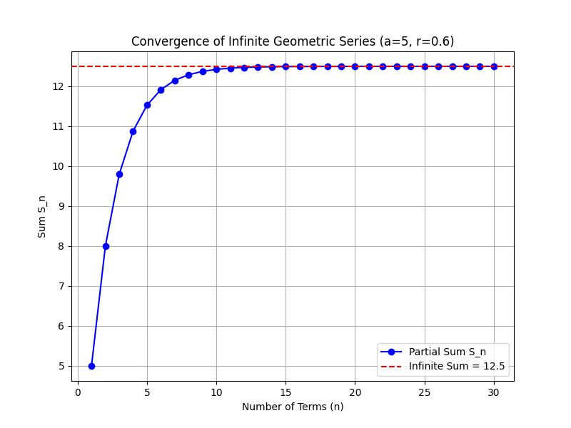

## Sum of Geometric Series and Tests for Convergence

A geometric series is a sum in which each term is produced by multiplying the previous term by a constant factor called the common ratio. This lesson explains how to find the sum for both finite and infinite geometric series and reviews tests to determine when these series converge.

### Definition of a Geometric Series

A geometric series has the form:

$$
a + ar + ar^2 + ar^3 + \cdots + ar^{n-1}
$$

Here:

- $a$ represents the first term.
- $r$ represents the common ratio.
- $n$ is the number of terms when the series is finite.

Every term in the series is generated by multiplying the previous term by $r$. This regular pattern is useful in many real applications, as it shows consistent growth or decay.

### Sum of a Finite Geometric Series

For a finite geometric series, the sum is calculated using the formula:

$$
S_n = a \cdot \frac{1 - r^n}{1 - r} \quad \text{(for } r \neq 1\text{)}
$$

This formula is derived by multiplying the series by $r$ and subtracting the resulting expression from the original series, which causes most terms to cancel out, leaving a simple expression to solve.

**Example 1:**

Find the sum of the finite geometric series with $a = 2$, $r = 3$, and $n = 4$.

Step 1: Write out the series explicitly:

$$
2 + 2 \cdot 3 + 2 \cdot 3^2 + 2 \cdot 3^3
$$

Step 2: Apply the sum formula:

$$
S_4 = 2 \cdot \frac{1 - 3^4}{1 - 3} = 2 \cdot \frac{1 - 81}{1 - 3}
$$

Step 3: Simplify the expression by performing the arithmetic:

$$
S_4 = 2 \cdot \frac{-80}{-2} = 2 \cdot 40 = 80
$$

This step-by-step process shows that the sum of the series is $80$.

### Sum of an Infinite Geometric Series

An infinite geometric series extends without end and is written as:

$$
a + ar + ar^2 + ar^3 + \cdots
$$

For such series, the sum is given by:

$$
S_{\infty} = \frac{a}{1 - r} \quad \text{if } |r| < 1
$$

This formula holds under the condition $|r| < 1$, which ensures that the terms become smaller and approach zero. If the absolute value of $r$ is not less than 1, the series does not approach a fixed value and thus diverges.

**Example 2:**

Find the sum of the infinite geometric series with $a = 5$ and $r = 0.6$.

Step 1: Verify the convergence condition. Since $|0.6| < 1$, the series converges.

Step 2: Substitute into the sum formula:

$$
S_{\infty} = \frac{5}{1 - 0.6} = \frac{5}{0.4} = 12.5
$$

Therefore, the sum of the infinite series is $12.5$.

### Tests for Convergence of Geometric Series

A geometric series converges if and only if the absolute value of its common ratio is less than 1:

$$
|r| < 1
$$

If $|r| \geq 1$, the infinite series diverges because the terms do not decrease to zero and the sum does not settle to a fixed number.

**Example 3:**

Determine whether the series with $a = 3$ and $r = 1.2$ converges.

Step 1: Evaluate the common ratio:

$$
|1.2| = 1.2 \quad \text{(greater than 1)}
$$

Step 2: Since $|r| \geq 1$, the series diverges. This means no fixed sum exists for the series.

### Convergence Using the Ratio Test

The ratio test is a general method to evaluate the convergence of a series. For a geometric series, the test involves comparing successive terms:

$$
L = \lim_{n \to \infty} \left| \frac{a_{n+1}}{a_n} \right|
$$

In a geometric series, the ratio $\left| \frac{a_{n+1}}{a_n} \right|$ is constant and equal to $|r|$. Thus, the ratio test confirms that the series converges if:

$$
|r| < 1
$$

and diverges if:

$$
|r| \geq 1
$$

### Real-World Applications

Geometric series appear in many practical areas:

- **Finance:** They are used to calculate the future value of investments with compound interest, where each term represents an accumulation over a period.

- **Engineering:** They model processes such as signal attenuation, where the strength of a signal decreases by a fixed ratio at each stage.

- **Gaming Statistics:** They help estimate diminishing returns on repeated actions or rewards, capturing how benefits decrease over successive trials.

### Summary Steps

1. Identify the first term $a$ and the common ratio $r$.

2. For a finite series with $n$ terms, use the formula:

   $$
   S_n = a \cdot \frac{1 - r^n}{1 - r}
   $$

3. For an infinite series, ensure $|r| < 1$ before applying:

   $$
   S_{\infty} = \frac{a}{1 - r}
   $$

4. If $|r| \geq 1$, recognize that the series does not converge.

This lesson has presented detailed methods and tests related to geometric series. The clear, step-by-step explanations help in understanding both the computational methods and the underlying intuition of convergence, key to applying these concepts in real-world problem solving and on the College Algebra CLEP exam.