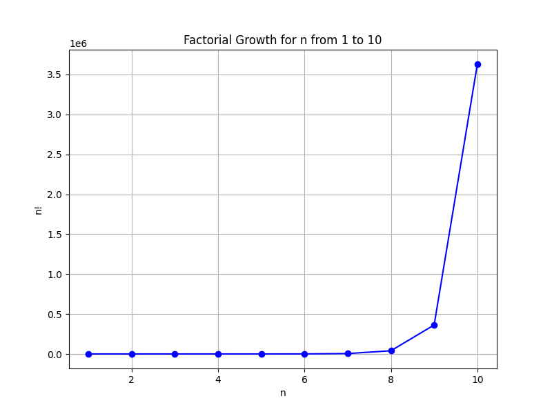
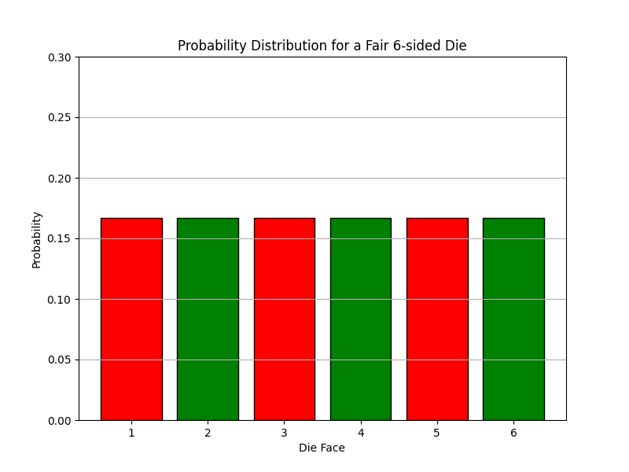

## Introduction to Combinatorics and Basic Probability

This lesson introduces the basic ideas of combinatorics and probability. You will learn how to count objects using various methods and how to calculate simple probabilities. These concepts help in many areas, including decision making, gaming statistics, and real-world problem solving.

### Combinatorial Counting

Combinatorics is the study of counting without having to list every option. We use several methods to count objects when order matters or does not matter.

#### The Multiplication Principle

If one event can occur in $m$ ways and a second event can occur in $n$ ways, then the total number of outcomes is

$$
Total = m \times n
$$

For example, if you have 3 shirts and 2 pairs of pants, the number of outfits is $3 \times 2 = 6$.

#### Factorial

A factorial, written as $n!$, is the product of all positive integers up to $n$. For example,

$$
5! = 5 \times 4 \times 3 \times 2 \times 1 = 120
$$

It is useful in counting arrangements where order matters.

#### Permutations (Order Matters)

Permutations count the number of ways to arrange a set of objects. The formula for the number of permutations of $r$ objects taken from $n$ objects is

$$
P(n, r) = \frac{n!}{(n - r)!}
$$

*Example:* Suppose you want to arrange 3 books out of 5 on a shelf. Then

$$
P(5, 3) = \frac{5!}{(5-3)!} = \frac{120}{2!} = \frac{120}{2} = 60
$$

There are 60 different ways to arrange these 3 books.

#### Combinations (Order Does Not Matter)

Combinations count the number of ways to select items when the order is not important. The formula for combinations is

$$
C(n, r) = \frac{n!}{r!(n - r)!}
$$

*Example:* If you need to choose 3 team members from a group of 5, then

$$
C(5, 3) = \frac{5!}{3!(5-3)!} = \frac{120}{6 \times 2} = \frac{120}{12} = 10
$$

There are 10 different ways to choose the team members.

### Basic Probability

Probability measures how likely it is for an event to occur. The probability of an event is defined as

$$
Probability = \frac{\text{Number of favorable outcomes}}{\text{Total number of outcomes}}
$$

This value ranges from 0 to 1, where 0 means the event will not occur and 1 means the event will always occur.

#### Example: Rolling a Die

Consider a fair 6-sided die. To find the probability of rolling an even number, follow these steps:

1. List the total outcomes: {1, 2, 3, 4, 5, 6} (6 outcomes).
2. Identify the favorable outcomes: {2, 4, 6} (3 outcomes).
3. Apply the probability formula:

$$
Probability = \frac{3}{6} = \frac{1}{2}
$$

Thus, the probability of rolling an even number is $\frac{1}{2}$.

### Real-World Applications

These counting techniques and probability calculations are used in various fields:

- In gaming, to calculate the odds of winning or losing.
- In finance, to estimate the likelihood of different market scenarios.
- In sports analytics, to determine winning strategies or player selections.
- In engineering, to assess risk and plan for different outcomes.

### Step-by-Step Example: Secret Code Combinations

Imagine you are setting a lock with a 4-digit code. Each digit can be any number from 0 to 9. To find the total number of different codes possible, use the Multiplication Principle. Each digit has 10 potential outcomes.

$$
Total\;codes = 10 \times 10 \times 10 \times 10 = 10^4 = 10000
$$

So there are 10,000 possible combinations for the lock.

### Summary of Key Formulas

- Multiplication Principle: Total outcomes = $m \times n$
- Factorial: $n! = n \times (n-1) \times \cdots \times 1$
- Permutations: $P(n, r) = \frac{n!}{(n - r)!}$
- Combinations: $C(n, r) = \frac{n!}{r!(n - r)!}$
- Probability: $Probability = \frac{\text{Favorable outcomes}}{\text{Total outcomes}}$

This lesson provides foundational tools used in many areas of mathematics and real-life problem solving. With these techniques, you can analyze simple probability problems and count outcomes in varied scenarios.