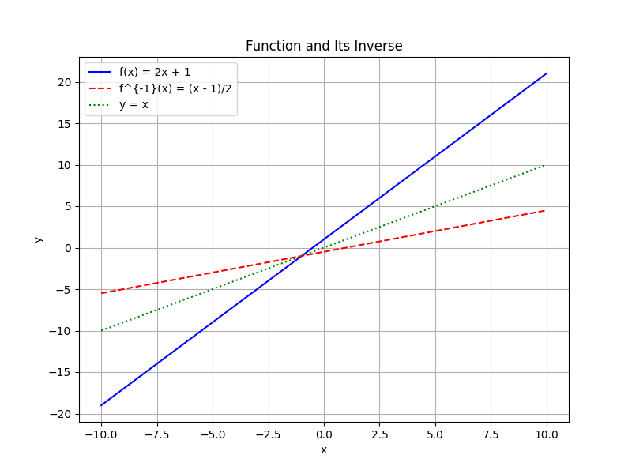

# Function Applications and Modeling

In this unit, we explore how functions can be used to model real-world situations and solve applied problems. We introduce methods to construct functions that represent everyday scenarios in fields such as finance, engineering, and science.

Developing functions from data allows you to create mathematical models that approximate relationships among quantities. For example, by collecting data on monthly expenses and income, you can form a function to predict future financial needs.

Interpreting function behavior involves understanding how changes in one variable affect another. This is especially useful when analyzing trends or forecasting outcomes, such as estimating the growth of a population.

Applying functions to model dynamic systems means constructing relationships that change over time. This approach is common in physics and engineering, for instance, when modeling the speed of a vehicle or temperature variations in a process.

Understanding composite and inverse functions provides a way to reverse or combine processes. Composite functions allow analysis of multi-step procedures, while inverse functions help determine original inputs from known outputs, such as tracing back to the starting amount in financial transactions.

By studying these applications, you will learn why functions are a powerful tool in problem solving and decision making. They provide a systematic way to represent relationships between quantities and predict outcomes in complex scenarios. The methods discussed in this unit enable you to construct accurate models, simulate different situations, and analyze the impact of changing variables.

> Function applications and modeling are the translators of mathematics, converting abstract symbols into maps that navigate the intricate landscapes of the real world.