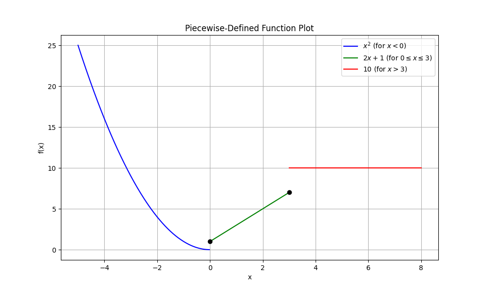

## Lesson: Working with Piecewise-Defined Functions

Piecewise-defined functions use different expressions for different parts of their domains. This lesson explains how to evaluate and graph these functions step by step, building your intuition for when and why each rule is applied.

### Understanding Piecewise-Defined Functions

A piecewise-defined function is written with separate formulas for different intervals. Each piece applies to a certain part of the domain of the function. For example, consider the function:

$$
f(x)=\begin{cases}
x^2 & \text{if } x < 0, \\
2x+1 & \text{if } 0 \le x \le 3, \\
10 & \text{if } x > 3.
\end{cases}
$$

In this function, the formula $x^2$ is used when $x$ is negative, the formula $2x+1$ for values of $x$ between 0 and 3 (including 0 and 3), and the constant value $10$ when $x$ is greater than 3. This structure allows different behaviors over different intervals, reflecting real situations where rules change based on conditions.

> A piecewise function lets you model situations where the rule changes based on the value of $x$.

### Evaluating a Piecewise Function

To evaluate a piecewise function, follow these clear steps:

1. Identify the input value.
2. Determine which condition (or interval) the input satisfies.
3. Substitute the input into the corresponding expression to find the output.

These steps help you correctly apply the right formula for the given value.

#### Example 1: Evaluate $f(x)$ at Different Points

Using the function above:

$$
f(x)=\begin{cases}
x^2 & \text{if } x < 0, \\
2x+1 & \text{if } 0 \le x \le 3, \\
10 & \text{if } x > 3.
\end{cases}
$$

- **For $x = -2$:**

  Since $-2$ is less than 0, we use the formula $x^2$:

  $$
f(-2)=(-2)^2=4.
  $$

  This tells us that when $x$ is negative, the function squares the input.

- **For $x = 0$:**

  The value $0$ falls in the interval from 0 to 3, so we use $2x+1$:

  $$
f(0)=2(0)+1=1.
  $$

  Here, you see that the function shifts the input linearly.

- **For $x = 5$:**

  Since $5$ is greater than 3, the function gives a constant value:

  $$
f(5)=10.
  $$

This process shows how each rule applies only to its specified interval.

### Graphing Piecewise Functions

Graphing a piecewise function requires you to plot each segment over only its designated interval. This approach makes it clear where each rule starts and ends. Here are some tips:

- **Draw a number line.** Mark the boundaries where the expression changes.
- **Plot each function segment.** For each interval, draw the graph corresponding to its rule. Use open circles at endpoints that are not included and closed circles at endpoints that are included.

#### Example 2: Sketching the Graph

Below is a plot that visualizes the piecewise-defined function described by $f(x)=x^2$ for $x<0$, $f(x)=2x+1$ for $0 \le x \le 3$, and $f(x)=10$ for $x>3$.

On the graph:

- For $x < 0$, the parabola reflects the behavior of $f(x)=x^2$. Notice points such as $f(-2)=4$ and $f(-1)=1$.
- For $x$ between 0 and 3, the line $y=2x+1$ is plotted. This linear part shows a steady increase from $f(0)=1$ to $f(3)=7$.
- For $x > 3$, the function is constant. A horizontal line is drawn at $y=10$, starting just after $x=3$.

Carefully marking endpoints on your graph ensures accuracy in representing the function.

### Real-World Application: Shipping Costs

Piecewise functions are useful for modeling real-life situations. Consider a shipping cost model defined by:

$$
C(w)=\begin{cases}
5 & \text{if } 0 < w \le 2, \\
5+2(w-2) & \text{if } 2 < w \le 5, \\
11+3(w-5) & \text{if } w > 5,
\end{cases}
$$

where $w$ represents the weight of a package. The function changes its rule based on weight:

- For a package weighing 1.5 units, the cost is $5$, because $w \le 2$.
- For a package weighing 3 units, the second rule applies:

  $$
  C(3)=5+2(3-2)=5+2=7.
  $$

- For a package weighing 6 units, the third rule gives:

  $$
  C(6)=11+3(6-5)=11+3=14.
  $$

This example shows how different cost formulas can apply depending on the conditions, similar to tax brackets or utility rates.

### Summary of Steps

- Identify the appropriate section of the piecewise function based on the input value.
- Substitute the input value into the corresponding expression.
- Graph each segment only over its correct interval, using proper endpoints to mark where each rule applies.

Understanding piecewise-defined functions is essential as they appear in many real-world problems. Knowing how to evaluate and graph these functions prepares you to tackle problems related to shipping costs, tax calculations, and other applications in College Algebra and beyond.