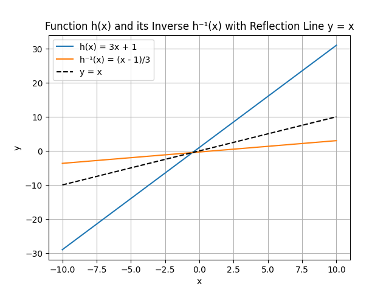

## Solving Problems Using Composite and Inverse Functions

Composite and inverse functions are powerful tools in algebra that allow you to combine or reverse operations. This lesson explains the concepts step by step with detailed explanations and real-life applications to help you master these skills.

### Understanding Composite Functions

A composite function is formed when one function is applied to the result of another. In a composite function $f(g(x))$, you first evaluate $g(x)$ and then use that result as the input for $f(x)$. This process is like a two-step operation that simplifies complex calculations by breaking them into more manageable parts.

For example, let

$$
f(x)=2x+3
$$

and

$$
g(x)=x^2.
$$

To compute $f(g(x))$, follow these steps:

1. Calculate $g(x)$.

2. Substitute the value of $g(x)$ into $f(x)$.

This method helps you understand the flow of operations and reinforces the idea of sequential processing in functions.

### Example: Evaluating a Composite Function

Suppose you want to evaluate $(f \circ g)(2)$. Follow these steps:

1. Compute $g(2)$:

$$
g(2)=2^2=4.
$$

2. Substitute the result into $f(x)$:

$$
f(4)=2(4)+3=11.
$$

Thus, $(f \circ g)(2)=11$.

### Understanding Inverse Functions

An inverse function reverses the effect of the original function. If a function $f$ maps an input $x$ to an output $y$, then the inverse function $f^{-1}$ maps $y$ back to $x$. In other words, applying $f^{-1}$ undoes what $f$ does.

The key property of inverse functions is:

$$
f(f^{-1}(x))=x \quad \text{and} \quad f^{-1}(f(x))=x.
$$

To find the inverse of a function, swap the roles of $x$ and $y$ and then solve for $y$. This process essentially reverses the original operation.

### Example: Finding the Inverse of a Composite Function

Consider two functions:

$$
f(x)=x+1
$$

and

$$
g(x)=3x.
$$

First, form the composite function $h(x)$:

$$
h(x)=f(g(x))=f(3x)=3x+1.
$$

Now, to find the inverse of $h(x)$, follow these steps:

Step 1. Write the function using $y$:

$$
y=3x+1.
$$

Step 2. Swap $x$ and $y$:

$$
x=3y+1.
$$

Step 3. Solve for $y$:

Subtract 1 from both sides:

$$
x-1=3y.
$$

Divide both sides by 3:

$$
y=\frac{x-1}{3}.
$$

Thus, the inverse function is

$$
h^{-1}(x)=\frac{x-1}{3}.
$$

This process demonstrates how the inverse function undoes the operations of the composite function.

### Real-World Application: Converting Temperature

Composite functions are useful in modeling real-world multi-step processes. Consider converting a temperature from Celsius to Fahrenheit after increasing the temperature by 1 degree Celsius.

Let

$$
g(x)=x+1
$$

represent the temperature increase, and

$$
f(x)=\frac{9}{5}x+32
$$

represent the conversion to Fahrenheit.

The composite function $f(g(x))$ works as follows:

1. Increase $x$ by 1:

$$
g(x)=x+1.
$$

2. Convert the new temperature to Fahrenheit:

$$
f(g(x))=\frac{9}{5}(x+1)+32.
$$

If the original temperature is $20^\circ$C:

$$
g(20)=20+1=21,
$$

and then,

$$
f(21)=\frac{9}{5}(21)+32=\frac{189}{5}+32=37.8+32=69.8^\circ\text{F}.
$$

This example illustrates how composite functions efficiently handle sequential operations by combining them into a single function.

### Summary of Steps

- To evaluate a composite function $f(g(x))$, first calculate $g(x)$ and then substitute that result into $f(x)$.

- To find an inverse function, express the function as $y=f(x)$, swap $x$ and $y$, and solve for $y$.

These techniques simplify multi-step problems by breaking them into clear, sequential operations, which is essential for modeling and solving diverse algebraic problems effectively. Mastering these concepts is crucial for success on the College Algebra CLEP exam.