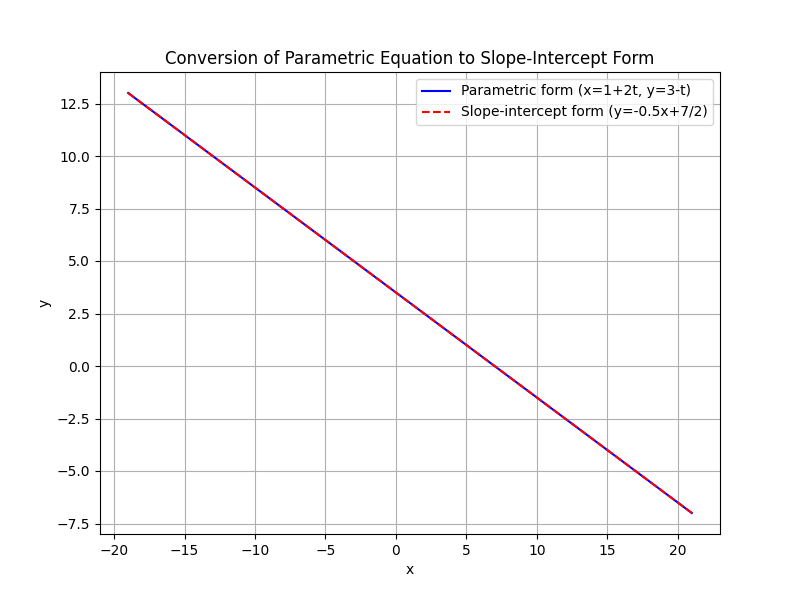

## Exploring Parameterized Equations and Models

Parameterized equations introduce one or more parameters to represent a family of related equations. In these models, a parameter is a constant whose value can vary, allowing the equation to adapt to different scenarios. Understanding these concepts is essential for modeling real-world situations where conditions change.

### What Is a Parameter?

A parameter is a quantity that helps define a system or set of equations. Unlike variables, parameters remain fixed while defining a specific instance of a family of equations. By changing the parameter value, you generate different, yet related, outcomes.

> A parameter adjusts the model without changing its underlying structure.

### Parameterized Equations in Algebra

A parameterized equation includes one or more parameters along with the usual variables. For example, consider the linear equation in slope-intercept form:

$$
 y = mx + b
$$

Here, $m$ and $b$ are parameters that determine the slope and $y$-intercept, respectively. By adjusting $m$ and $b$, you obtain different lines on a graph.

Parameterized equations also appear in other forms. For instance, a line in the plane can be expressed using a parameter $t$ as follows:

$$
 x = x_0 + at, \quad y = y_0 + bt
$$

In this form, $(x_0, y_0)$ is a point on the line and $a$, $b$ determine its direction. The parameter $t$ can take any real number, generating all points on the line.

### Example 1: Converting Parametric Equations to Slope-Intercept Form

Suppose a line is given in parametric form:

$$
 x = 1 + 2t \quad\text{and} \quad y = 3 - t
$$

Follow these steps to convert it into slope-intercept form:

1. Solve the first equation for $t$:

$$
 t = \frac{x - 1}{2}
$$

2. Substitute this expression for $t$ into the equation for $y$:

$$
 y = 3 - \frac{x - 1}{2}
$$

3. Simplify the equation:

$$
 y = 3 - \frac{1}{2}x + \frac{1}{2} = \frac{7}{2} - \frac{1}{2}x
$$

The slope-intercept form is:

$$
 y = -\frac{1}{2}x + \frac{7}{2}
$$

This shows how the parameter $t$ helps define the line, and eliminating it yields a more familiar equation.

### Example 2: A Real-World Parameterized Model

Consider a scenario in which a company models its cost $C$ based on the number of units produced $n$. The cost includes a fixed cost and a variable cost per unit, represented by the parameter $k$:

$$
 C(n) = C_0 + kn
$$

Where:

- $C_0$ is the fixed cost (an initial investment).
- $k$ is the variable cost per unit, a parameter that changes based on production efficiency or market conditions.

**Step-by-Step Analysis:**

1. Identify the parameters in the model:
   - $C_0$ is fixed, for example, $C_0 = 5000$ dollars.
   - The variable cost, $k$, might be $20$ dollars per unit.

2. Write the cost model with these values:

$$
 C(n) = 5000 + 20n
$$

3. Change $k$ to see how the model reacts. If improvements reduce the variable cost to $18$ dollars:

$$
 C(n) = 5000 + 18n
$$

The model now shows a lower cost per unit. This parameterized approach helps the company evaluate the impact of changes in production costs.

### Understanding the Role of Parameters

Parameters allow us to:

- Represent families of equations with a single general formula.
- Adjust models without altering the fundamental relationship between variables.
- Analyze sensitivity to changes in conditions or inputs, which is especially useful in planning and decision making.

### Conclusion

In parameterized equations and models, parameters are used to generalize relationships. By systematically varying these constant values, you generate a range of specific instances that can model a variety of real-world situations. Whether converting parametric equations into a familiar form or using parameters to capture dynamic costs in a business model, mastering this concept is essential for the CLEP exam and real-life applications.