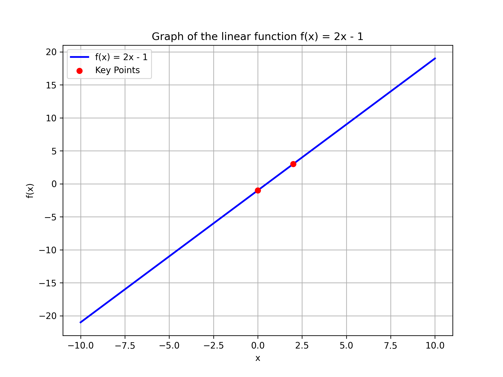

## Integrated Review of Algebraic Concepts

This lesson integrates the fundamental algebraic concepts you have studied, combining operations on expressions, solving equations, factoring, and understanding functions. Each section reviews key ideas with detailed, step-by-step examples and applications in real-world contexts.

### 1. Algebraic Expressions and Operations

Algebraic expressions include numbers, variables, and operations. Understanding how to simplify these expressions is essential.

For example, consider the expression:

$$
3x + 4 - 2x + 5
$$

**Step 1:** Group like terms.

$$
(3x - 2x) + (4 + 5)
$$

**Step 2:** Simplify each group.

$$
x + 9
$$

This process is useful in many applications, such as calculating total costs where parts of the cost are represented by variables.

### 2. Solving Linear Equations

To solve linear equations, isolate the variable on one side. Consider the equation:

$$
2x + 7 = 19
$$

**Step 1:** Subtract 7 from both sides.

$$
2x = 12
$$

**Step 2:** Divide by 2.

$$
x = 6
$$

This method applies, for instance, in financial planning when computing unknown amounts such as interest payments or savings contributions.

### 3. Factoring and Quadratic Equations

Factoring is a method to simplify the process of solving quadratic equations. Consider the quadratic equation:

$$
x^2 + 5x + 6 = 0
$$

**Step 1:** Factor the quadratic expression.

$$
(x + 2)(x + 3) = 0
$$

**Step 2:** Set each factor equal to zero.

$$
x + 2 = 0 \quad\text{or}\quad x + 3 = 0
$$

**Step 3:** Solve for $x$.

$$
x = -2 \quad\text{or}\quad x = -3
$$

Factoring techniques assist in many types of design and engineering problems where quadratic relationships determine key dimensions or performance characteristics.

### 4. Functions and Graph Interpretation

A function expresses the relationship between two quantities. Consider the linear function:

$$
f(x) = 2x - 1
$$

Graphing this function helps visualize behavior. Plot key points:

- For $x=0$, $$ f(0) = -1 $$
- For $x=2$, $$ f(2) = 3 $$

Plot these points on a coordinate system and draw a straight line through them. The slope ($2$) indicates a steady rate of change. Such graphs are used in disciplines like sports analytics to compare performance metrics over time.

### 5. Integrated Problem Example

Consider a scenario where a gaming company is tracking the in-game earnings of a player. The earnings in dollars are modeled by:

$$
E(x) = 3x + 7
$$

where $x$ is the number of levels completed.

**Problem:** If a player needs to earn $22 dollars, find the number of levels required.

**Step 1:** Set up the equation.

$$
3x + 7 = 22
$$

**Step 2:** Subtract 7 from both sides.

$$
3x = 15
$$

**Step 3:** Divide by 3.

$$
x = 5
$$

The player must complete 5 levels. This integrated approach shows how you apply multiple algebra concepts to solve real world problems.

By reviewing and linking these concepts, you enhance your ability to tackle a wide range of algebraic problems, an important skill when preparing for the College Algebra CLEP exam.