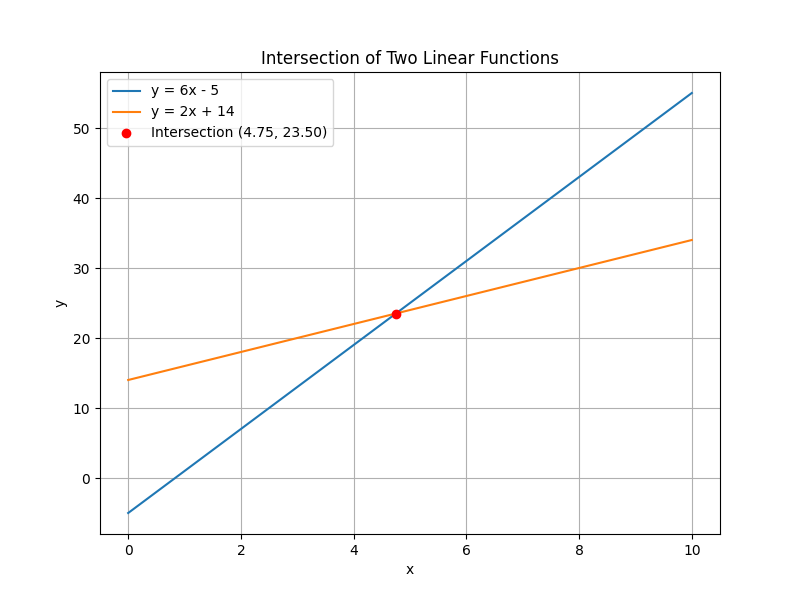
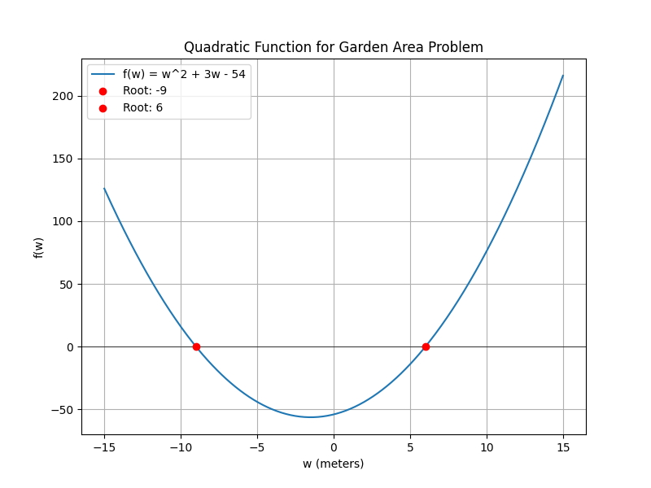

## 12-02-lesson-mixed-problem-solving-techniques

This lesson covers a variety of strategies for solving algebraic problems that do not follow one single template. In many real-world scenarios, problems may combine different types of equations and require multiple problem-solving techniques. Understanding how to identify the type of problem and applying a structured approach can simplify even the most complex tasks.

### Identifying the Problem Type

Before solving a problem, examine the information provided:

- Look for keywords that indicate the operations involved (e.g., distribution, combining like terms, factoring).
- Identify whether the problem is linear, quadratic, or involves more than one step, such as setting up an equation from a word problem.
- Decide on a method: Should you distribute, factor, or apply the quadratic formula?

A careful review of the problem helps select the most efficient strategy.

### Example 1: Solving a Complex Linear Equation

In this example, we will solve a linear equation that requires distribution and combining like terms.

Consider the equation:

$$
3(2x - 3) + 4 = 2(x + 7)
$$

Step 1: Distribute on both sides:

$$
6x - 9 + 4 = 2x + 14
$$

Step 2: Combine like terms on the left side:

$$
6x - 5 = 2x + 14
$$

Step 3: Isolate the variable by subtracting $2x$ from both sides:

$$
4x - 5 = 14
$$

Step 4: Add $5$ to both sides:

$$
4x = 19
$$

Step 5: Divide both sides by $4$:

$$
x = \frac{19}{4}
$$

The solution to the equation is $x = \frac{19}{4}$.

> The key in mixed problem solving is breaking the problem into manageable steps and verifying each operation.

### Example 2: Real-World Quadratic Problem

Sometimes, mixed problems involve quadratic equations derived from real-life situations. Consider a problem based on area:

A rectangular garden has a width of $w$ meters and a length that is $3$ meters longer than its width. If the area of the garden is $54$ square meters, determine the dimensions of the garden.

Step 1: Define the variables and set up the equation. Let the width be $w$. Then the length is $w + 3$. The area (length $\times$ width) is given by:

$$
w(w + 3) = 54
$$

Step 2: Expand the equation:

$$
w^2 + 3w = 54
$$

Step 3: Rearrange the equation to set it to zero:

$$
w^2 + 3w - 54 = 0
$$

Step 4: Factor or use the quadratic formula. We look for factors of $-54$ that add up to $3$. The numbers $9$ and $-6$ work:

$$
w^2 + 9w - 6w - 54 = 0
$$

Group the terms:

$$
(w^2 + 9w) - (6w + 54) = 0
$$

Factor each group:

$$
w(w + 9) -6(w + 9) = 0
$$

Factor by grouping:

$$
(w + 9)(w - 6) = 0
$$

Step 5: Solve for $w$ by setting each factor equal to zero:

$$
w + 9 = 0 \quad \text{or} \quad w - 6 = 0
$$

Thus, $w = -9$ or $w = 6$. Since a width cannot be negative, the width is $6$ meters. The length is:

$$
6 + 3 = 9 \quad \text{meters}
$$

Step 6: Verify the area:

$$
6 \times 9 = 54 \quad \text{square meters}
$$

The garden dimensions are confirmed: $6$ meters by $9$ meters.

### Strategies for Mixed Problem Solving

- Always start by clarifying what is required and what information is provided.
- Use a step-by-step approach: distribute, combine like terms, isolate variables, and verify your answer.
- Check intermediate results before moving on to the next step.
- For quadratic problems, consider factoring first as it is often the quickest method. If factoring is difficult, use the quadratic formula:

$$
x = \frac{-b \pm \sqrt{b^2 - 4ac}}{2a}
$$

Mixed problem-solving techniques help build the flexibility needed to tackle a variety of algebraic challenges, ensuring you can adapt your methods depending on the situation.