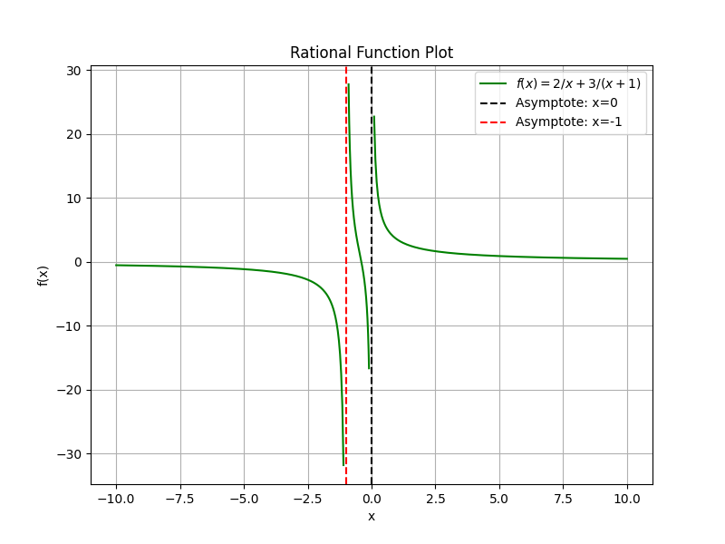

## Final Challenge Problems for College Algebra CLEP Preparation

This lesson presents a series of comprehensive challenge problems that cover various topics from college algebra. Each problem is broken down into clear, methodical steps. These examples will reinforce your understanding and prepare you for the College Algebra CLEP exam.

### Problem 1: Solving a Quadratic Equation

Solve the quadratic equation:

$$
2x^2 - 3x - 5 = 0
$$

**Step 1:** Identify coefficients. Here, $a = 2$, $b = -3$, and $c = -5$.

**Step 2:** Write the quadratic formula:

$$
x = \frac{-b \pm \sqrt{b^2 - 4ac}}{2a}
$$

**Step 3:** Substitute the coefficients into the formula:

$$
x = \frac{-(-3) \pm \sqrt{(-3)^2 - 4(2)(-5)}}{2(2)}
$$

**Step 4:** Simplify:

$$
x = \frac{3 \pm \sqrt{9 + 40}}{4}
$$

$$
x = \frac{3 \pm \sqrt{49}}{4}
$$

$$
x = \frac{3 \pm 7}{4}
$$

**Step 5:** Find the two solutions:

For the positive square root:

$$
x = \frac{3 + 7}{4} = \frac{10}{4} = \frac{5}{2}
$$

For the negative square root:

$$
x = \frac{3 - 7}{4} = \frac{-4}{4} = -1
$$

### Problem 2: Solving a Rational Equation

Solve the rational equation:

$$
\frac{2}{x} + \frac{3}{x+1} = 1
$$

**Step 1:** Identify the common denominator, which is $x(x+1)$.

**Step 2:** Multiply both sides of the equation by $x(x+1)$ to clear the fractions:

$$
x(x+1) \left( \frac{2}{x} + \frac{3}{x+1} \right) = x(x+1)(1)
$$

This gives:

$$
2(x+1) + 3x = x^2 + x
$$

**Step 3:** Expand and simplify:

$$
2x + 2 + 3x = x^2 + x
$$

$$
5x + 2 = x^2 + x
$$

**Step 4:** Rearrange the equation to set it to zero:

$$
x^2 + x - 5x - 2 = 0
$$

$$
x^2 - 4x - 2 = 0
$$

**Step 5:** Solve this quadratic equation using the quadratic formula with $a=1$, $b=-4$, and $c=-2$:

$$
x = \frac{-(-4) \pm \sqrt{(-4)^2 - 4(1)(-2)}}{2(1)}
$$

$$
x = \frac{4 \pm \sqrt{16 + 8}}{2}
$$

$$
x = \frac{4 \pm \sqrt{24}}{2}
$$

Since $\sqrt{24} = 2\sqrt{6}$, we have:

$$
x = \frac{4 \pm 2\sqrt{6}}{2}
$$

$$
x = 2 \pm \sqrt{6}
$$

### Problem 3: Solving an Exponential Equation
Solve the exponential equation:

$$
3^{2x} = 81
$$

**Step 1:** Express $81$ as a power of $3$. Since $81 = 3^4$, rewrite the equation:

$$
3^{2x} = 3^4
$$

**Step 2:** Equate the exponents (since the bases are equal):

$$
2x = 4
$$

**Step 3:** Solve for $x$:

$$
x = 2
$$

### Problem 4: Solving a Simple Linear Equation (Using Substitution)
Solve the linear equation:

$$
7y - 25 = 0
$$

**Step 1:** Isolate the term with $y$:

$$
7y = 25
$$

**Step 2:** Divide both sides by $7$:

$$
y = \frac{25}{7}
$$

This problem demonstrates the use of substitution when a variable is isolated.

> Key Insight: Always ensure that math expressions are completely enclosed within dollar signs or display math delimiters. Missing a closure symbol can lead to compilation errors.

Each of these problems reinforces different concepts in college algebra. Follow the steps carefully, and check each transition from one step to the next to ensure accuracy in your work.